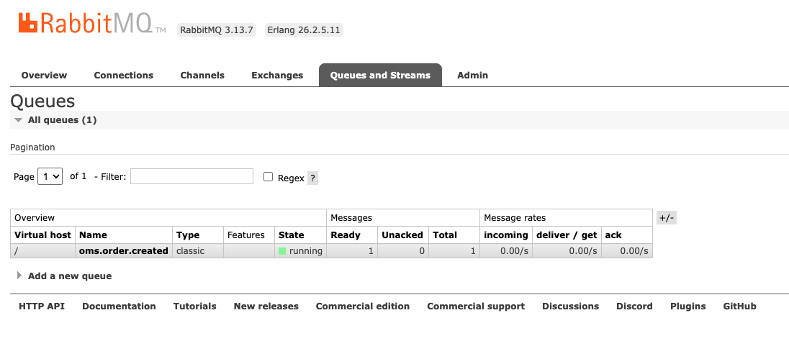
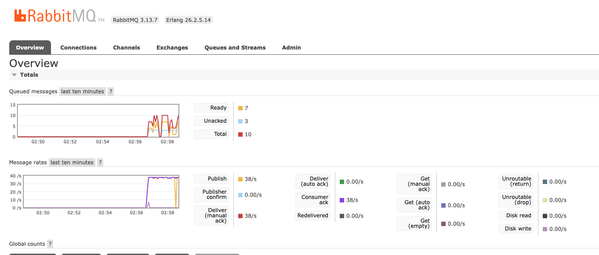
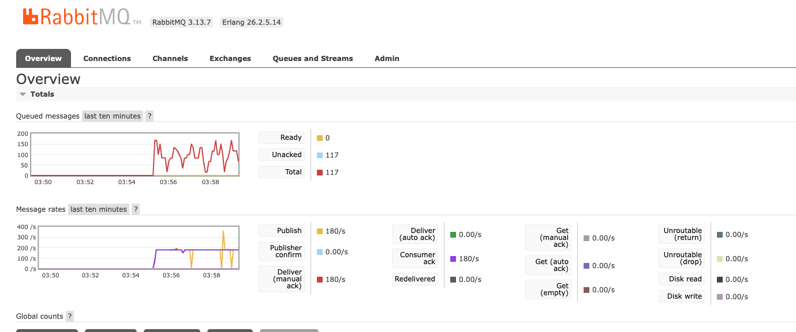

# Лаба 3
### Больше реплик богу реплик

> Камнем преткновения в большинстве высоконагруженных систем является БД.
> Поэтому изначально нам надо немного пропатчить конфиг для постгреса.

1. Создаем в корне проекта (около docker-compose.yml) файл `postgresql.conf` с настройками:
```
# === БАЗОВЫЕ НАСТРОЙКИ ===
listen_addresses = '*'
port = 5432
max_connections = 200
shared_buffers = 128MB
effective_cache_size = 512MB
work_mem = 4MB
maintenance_work_mem = 64MB

# === НАСТРОЙКИ АУТЕНТИФИКАЦИИ ===
password_encryption = scram-sha-256
ssl = off

# === НАСТРОЙКИ WAL ===
wal_buffers = 16MB
checkpoint_completion_target = 0.9
max_wal_size = 1GB
min_wal_size = 80MB

# === НАСТРОЙКИ ПЛАНИРОВЩИКА ЗАПРОСОВ ===
random_page_cost = 1.1
effective_io_concurrency = 200

# === НАСТРОЙКИ ЛОГИРОВАНИЯ ===
log_min_duration_statement = 1000
log_connections = on
log_disconnections = on
log_destination = 'stderr'
logging_collector = off

# === НАСТРОЙКИ ТАЙМАУТОВ ===
idle_in_transaction_session_timeout = 10min
```

Описание каждой настройки:

#### Базовые настройки
| Параметр | Что делает | Кратко зачем нужен |
| :-- | :-- | :-- |
| **`listen_addresses = '*'`** | Задаёт IP-адреса, на которых сервер «слушает» соединения. | В Docker ставим `*`, чтобы контейнеры виделись друг другу. |
| **`port = 5432`** | TCP-порт PostgreSQL. | Стандартный порт; меняйте только при необходимости. |
| **`max_connections = 200`** | Максимальное число одновременных клиентских сессий. | Завышать — лишний расход RAM; занижать — «too many clients already». |
| **`shared_buffers = 128MB`** | Размер внутреннего буфера данных. | Ориентир — ~25% RAM; ускоряет чтение. |
| **`effective_cache_size = 512MB`** | Оценка кэша ОС, доступного Postgres. | Помогает оптимизатору планировать запросы. |
| **`work_mem = 4MB`** | Память на сортировку/хеш-операцию в рамках одного запроса. | Малое значение → временные файлы на диск. |
| **`maintenance_work_mem = 64MB`** | Память для VACUUM, CREATE INDEX и др. сервисных задач. | Увеличивает скорость обслуживания БД. |

#### Аутентификация

| Параметр | Описание | Замечания |
| :-- | :-- | :-- |
| **`password_encryption = scram-sha-256`** | Способ хранения паролей. | SCRAM — современный и безопасный. |
| **`ssl = off`** | Включает/выключает SSL-шифрование соединений. | Внутри docker-сети можно оставить `off`; наружу — лучше `on`. |

#### WAL (журнал предзаписи)

| Параметр | Что регулирует | Типовой эффект |
| :-- | :-- | :-- |
| **`wal_buffers = 16MB`** | RAM-буфер перед записью WAL на диск. | Больше буфер — реже и крупнее операции записи. |
| **`checkpoint_completion_target = 0.9`** | Доля интервала, за которую выполняется checkpoint. | 0.9 — записи равномернее, пиков меньше. |
| **`max_wal_size = 1GB`** | Верхний предел объёма WAL между checkpoint’ами. | Чем больше — тем реже checkpoints. |
| **`min_wal_size = 80MB`** | Минимально сохраняемый объём WAL-файлов. | Уменьшает фрагментацию и паузы на создание файлов. |

#### Планировщик запросов

| Параметр | Назначение | Для SSD |
| :-- | :-- | :-- |
| **`random_page_cost = 1.1`** | Стоимость «случайного» чтения диска. | 1.0 – 1.5 вместо дефолтных 4.0. |
| **`effective_io_concurrency = 200`** | Сколько одновременных I/O операций диск выдержит. | NVMe — 100-1000; HDD — 1. |

#### Логирование

| Параметр | Что пишет в лог | Практика |
| :-- | :-- | :-- |
| **`log_min_duration_statement = 1000`** | Запросы дольше 1 с. | Помогает ловить «медляков». |
| **`log_connections = on`** | Старт каждой сессии. | Полезно для аудита. |
| **`log_disconnections = on`** | Завершение сессии и её длительность. | Видно «падающие» клиенты. |
| **`log_destination = 'stderr'`** | Куда выводить лог. | В контейнере удобно читать через `docker logs`. |
| **`logging_collector = off`** | Собирать логи отдельным процессом. | В Docker не нужен: всё уже идёт в stdout/stderr. |

#### Таймауты

| Параметр | Смысл | Почему важно |
| :-- | :-- | :-- |
| **`idle_in_transaction_session_timeout = 10min`** | Автозавершение «висящей» транзакции после 10 мин простоя. | Предотвращает блокировки и утечки соединений. |


***

### Важные рекомендации

- **Память**: следите, чтобы `shared_buffers` + `work_mem × max_connections` ≤ ≈ 80% RAM.
- **SSD**: снижайте `random_page_cost`, иначе оптимизатор будет переоценивать стоимость индексов.
- **WAL**: чем выше `max_wal_size`, тем реже checkpoint и выше производительность записи, но дольше recovery.
- **Мониторинг**: оставляйте `log_min_duration_statement` ≤ 1 s на проде — это недорого и помогает оптимизировать запросы.


2. Патчим `docker-compose.yml`:
```yaml
  postgres:
    image: postgres
    container_name: postgres
    environment:
      - POSTGRES_USER=user
      - POSTGRES_PASSWORD=mypassword
      - POSTGRES_DB=postgres
      - POSTGRES_HOST_AUTH_METHOD=scram-sha-256
      - POSTGRES_INITDB_ARGS=--auth-host=scram-sha-256
    volumes:
      - pgdata:/var/lib/postgresql/data/
      - ./postgresql.conf:/etc/postgresql/postgresql.conf
    command: postgres -c config_file=/etc/postgresql/postgresql.conf
    restart: unless-stopped
    healthcheck:
      test: ["CMD-SHELL", "pg_isready -U postgres -d postgres"]
      interval: 10s
      timeout: 5s
      retries: 3
  
  pgbouncer:
    image: bitnami/pgbouncer
    container_name: pgbouncer
    environment:
      - POSTGRESQL_HOST=postgres
      - POSTGRESQL_USERNAME=user
      - POSTGRESQL_DATABASE=postgres
      - POSTGRESQL_PASSWORD=mypassword
      - PGBOUNCER_IDLE_TRANSACTION_TIMEOUT=60
      - PGBOUNCER_POOL_MODE=transaction
      - PGBOUNCER_MIN_POOL_SIZE=5
      - PGBOUNCER_SERVER_RESET_QUERY_ALWAYS=0
      - PGBOUNCER_SERVER_LIFETIME=3600
      - PGBOUNCER_SERVER_IDLE_TIMEOUT=60
      - PGBOUNCER_MAX_DB_CONNECTIONS=50
      - PGBOUNCER_MAX_CLIENT_CONN=10000
      - PGBOUNCER_RESERVE_POOL_SIZE=5
      - PGBOUNCER_MIN_POOL_SIZE=2
      - PGBOUNCER_DEFAULT_POOL_SIZE=16
      - PGBOUNCER_IGNORE_STARTUP_PARAMETERS=extra_float_digits
    ports:
      - "15432:6432"
    depends_on:
      postgres:
        condition: service_healthy
    restart: unless-stopped

...
...
```

`./postgresql.conf:/etc/postgresql/postgresql.conf` - путь к файлу конфига в volume.

`command: postgres -c config_file=/etc/postgresql/postgresql.conf` - команда запуска postgres с конфигом из этого файла.


3. Отключаем автокоммит в UniverseLabs.Oms.Consumer и перестаем коммитить, если выпала ошибка:
```csharp
public class OmsOrderCreatedConsumer : IHostedService
{
    ...
    ...
    
    public async Task StartAsync(CancellationToken cancellationToken)
    {
        _connection = await _factory.CreateConnectionAsync(cancellationToken);
        _channel = await _connection.CreateChannelAsync(cancellationToken: cancellationToken);
        await _channel.QueueDeclareAsync(
            queue: _rabbitMqSettings.Value.OrderCreatedQueue, 
            durable: false, 
            exclusive: false,
            autoDelete: false,
            arguments: null, 
            cancellationToken: cancellationToken);

        var sw = new Stopwatch();

        await _channel.BasicQosAsync(prefetchSize: 0, prefetchCount: 1, global: false, cancellationToken: cancellationToken);
        _consumer = new AsyncEventingBasicConsumer(_channel);
        _consumer.ReceivedAsync += async (sender, args) =>
        {
            sw.Restart();
            try
            {
                var body = args.Body.ToArray();
                ...
                
                await _channel.BasicAckAsync(args.DeliveryTag, false, cancellationToken);
                sw.Stop();
                Console.WriteLine($"Order created consumed in {sw.ElapsedMilliseconds} ms");
            }
            catch (Exception ex)
            {
                Console.WriteLine(ex.Message);
                await _channel.BasicNackAsync(args.DeliveryTag, false, true, cancellationToken);
            }
        };
        
        await _channel.BasicConsumeAsync(
            queue: _rabbitMqSettings.Value.OrderCreatedQueue, 
            autoAck: false, 
            consumer: _consumer,
            cancellationToken: cancellationToken);
    }

    ...
}
```

`BasicNackAsync` - это как раз-таки не-acknowledgement, который не дает читать следующие сообщения из очереди, пока не будет устранена ошибка.

Также добавлен префеч `BasicQosAsync`, который помогает RabbitMQ грамотно настроить балансировку между несколькими подписчиками.

4. Дописываем в docker-compose.yml поднятие сервиса и консьюмера. (самостоятельно)
5. Теперь давайте сымитируем большую нагрузку на сервис. Создадим папку в UniverseLabs.Oms `Jobs`. В ней создадим 1 класс `OrderGenerator` с методом `ExecuteAsync`.
6. После чего подключаем нугет Autofixture, который позволяет генерировать случайные данные. Файл OrderGenerator.cs должен выглядеть так:
```charp
public class OrderGenerator(IServiceProvider serviceProvider): BackgroundService
{
    protected override async Task ExecuteAsync(CancellationToken stoppingToken)
    {
        var fixture = new Fixture();
        using var scope = serviceProvider.CreateScope();
        var orderService = scope.ServiceProvider.GetRequiredService<OrderService>();
        
        while (!stoppingToken.IsCancellationRequested)
        {
            var orders = Enumerable.Range(1, 10)
                .Select(_ =>
                {
                    var orderItem = fixture.Build<OrderItemUnit>()
                        .With(x => x.PriceCurrency, "RUB")
                        .With(x => x.PriceCents, 1000)
                        .Create();

                    var order = fixture.Build<OrderUnit>()
                        .With(x => x.TotalPriceCurrency, "RUB")
                        .With(x => x.TotalPriceCents, 1000)
                        .With(x => x.OrderItems, [orderItem])
                        .Create();

                    return order;
                })
                .ToArray();
                
            await orderService.BatchInsert(orders, stoppingToken);
            
            await Task.Delay(250, stoppingToken);
        }
    }
}
```

> Что тут происходит? Каждые 250 мс генерируется 10 заказов и вызывается ручка BatchInsert. То есть мы имитируем нагрузку в 40 заказов в секунду (но 4 RPS).
> Значит в очередь будет записываться 40 событий ежесекундно.

7. Подключаем сервис OrderGenerator в Program.cs:
```csharp
var builder = WebApplication.CreateBuilder(args);

...
builder.Services.AddSwaggerGen();
builder.Services.AddHostedService<OrderGenerator>();

var app = builder.Build();
...
```

8. Поднимаем все сервисы через `docker-compose up -d`.

> На этом шаге вам надо остановить контейнер с сервисом (который с контроллерами) и понаблюдать за логами контейнера с консьюмером.
> Вы должны там увидеть ошибки Internal Server Error 500, ибо сервис, в который консьюмер пишет лог, сейчас недоступен.
> И на главной панели RabbitMQ должен измениться показатель Redelivered.
> То есть RabbitMQ получил сообщение от консьюмера, что он не смог обработать сообщение, с флагом requeue = true, поэтому сообщение опять попало в очередь на обработку.
> И оно там будет висеть, пока вы не почините консьюмер (в нашем случае не поднимите сервис с контроллерами, в который ходит консьюмер).

9. Ждем пару минут после старта контейнеров и видим такую картину:
   
> Количество сообщений в очереди растет быстрее, чем успевает обрабатываться.
> Это чревато тем, что ваши асинхронные бизнес-процессы будут отставать и пользователи будут расстраиваться.
> Например вы отправляете смску о входе в личный кабинет, но она приходит через несколько минут.

10. Исправляем это патчингом docker-compose.yml:
```yaml
...
  universe-labs-consumer:
    image: universe-labs-consumer
    environment:
      - ASPNETCORE_ENVIRONMENT=Production
    build:
      context: .
      dockerfile: src/UniverseLabs.Oms.Consumer/Dockerfile
    deploy:
      replicas: 5
    depends_on:
      - rabbitmq
      - pgbouncer
...
```

Теперь если убить все контейнеры и поднять их заново, то он поднимет 3 реплики.

11. Ждем пару минут после старта контейнеров и видим такую картину:
    
> Как мы видим, скорость чтения очереди увеличилась, но количество сообщений в очереди не увеличилось.
> Это значит, что читаете вы также быстро, как и пишете в очередь.

12. Если вы все еще пишете логи в консьюмере, то посмотрите в каждый из 3х контейнеров. Каждый консьюмер получает уникальное событие, и RabbitMQ сам балансирует между ними.

> Окей, а если будет 10 продьюсеров и каждый будет валить в очередь по 50 событий в секунду?
Выходит, что нам надо поднять что-то около 50 консьюмеров. Где взять сервак на 50 ядер? Оставьте заявку в отделе снабжения вашей компании и глядишь через пару месяцев сервер введут в эксплуатацию.
И не забудьте, что 50 ядер нужно на проде, еще десяточку на тестовый стенд (нагрузочные тесты никто не отменял). Хотим такое решение?

13. Ладно, уговорили, напишем батчевый консьюмер. Благо, ручка записи аудит лога у нас тоже батчевая, и если она отваливается, то мы можем все сообщения из батча вернуть на ретрай.

14. Добавляем два поля в RabbitMqSettings: `ushort BatchSize` и `int BatchTimeoutSeconds`.
15. В appsettings.Development.json/appsettings.Production.json добавляем соответствующие настройки:
```json
{
  "RabbitMqSettings": {
    "HostName": "localhost",
    "Port": 5672,
    "OrderCreatedQueue" : "oms.order.created",
    "BatchSize": 100,
    "BatchTimeoutSeconds": 1
  }
}
```

16. Создаем папку Base в проекте UniverseLabs.Oms.Consumer:
    В ней два файла `MessageInfo` и `BaseBatchMessageConsumer`.
    MessageInfo:
```csharp
public class MessageInfo
{
    public string Message { get; set; }
    public ulong DeliveryTag { get; set; }
    public DateTimeOffset ReceivedAt { get; set; }
}
```
BaseBatchMessageConsumer:
```csharp
public abstract class BaseBatchMessageConsumer<T>(RabbitMqSettings rabbitMqSettings): IHostedService
    where T : class
{
    private IConnection _connection;
    private IChannel _channel;

    private readonly ConnectionFactory _factory = new() { HostName = rabbitMqSettings.HostName, Port = rabbitMqSettings.Port };
    private List<MessageInfo> _messageBuffer;
    private Timer _batchTimer;
    private SemaphoreSlim _processingSemaphore;

    protected abstract Task ProcessMessages(T[] messages);

    public async Task StartAsync(CancellationToken token)
    {
        _connection = await _factory.CreateConnectionAsync(token);
        _channel = await _connection.CreateChannelAsync(cancellationToken: token);
        
        _messageBuffer = new List<MessageInfo>();
        _processingSemaphore = new SemaphoreSlim(1, 1);
        
        // Настройка prefetch для батчевой обработки
        await _channel.BasicQosAsync(0, (ushort)(rabbitMqSettings.BatchSize * 2), false, token);
        
        var batchTimeout = TimeSpan.FromSeconds(rabbitMqSettings.BatchTimeoutSeconds);
        // Таймер для принудительной обработки по времени
        _batchTimer = new Timer(ProcessBatchByTimeout, null, batchTimeout, batchTimeout);
        
        await _channel.QueueDeclareAsync(
            queue: rabbitMqSettings.OrderCreatedQueue, 
            durable: false, 
            exclusive: false,
            autoDelete: false,
            arguments: null, 
            cancellationToken: token);
        
        var consumer = new AsyncEventingBasicConsumer(_channel);
        consumer.ReceivedAsync += OnMessageReceived;
        
        await _channel.BasicConsumeAsync(queue: rabbitMqSettings.OrderCreatedQueue, autoAck: false, consumer: consumer, cancellationToken: token);
    }
    
    private async Task OnMessageReceived(object sender, BasicDeliverEventArgs ea)
    {
        await _processingSemaphore.WaitAsync();
        
        try
        {
            var message = Encoding.UTF8.GetString(ea.Body.ToArray());
            _messageBuffer.Add(new MessageInfo
            {
                Message = message,
                DeliveryTag = ea.DeliveryTag,
                ReceivedAt = DateTimeOffset.UtcNow
            });

            // Если достигли лимита батча - обрабатываем
            if (_messageBuffer.Count >= rabbitMqSettings.BatchSize)
            {
                await ProcessBatch();
            }
        }
        finally
        {
            _processingSemaphore.Release();
        }
    }

    private async void ProcessBatchByTimeout(object state)
    {
        await _processingSemaphore.WaitAsync();
        
        try
        {
            if (_messageBuffer.Count > 0)
            {
                await ProcessBatch();
            }
        }
        finally
        {
            _processingSemaphore.Release();
        }
    }

    private async Task ProcessBatch()
    {
        if (_messageBuffer.Count == 0) return;

        var currentBatch = _messageBuffer.ToList();
        _messageBuffer.Clear();

        try
        {
            var messages = currentBatch.Select(x => x.Message.FromJson<T>()).ToArray();
            
            // Ваша логика обработки батча
            await ProcessMessages(messages);
            
            // ACK всех сообщений в батче (multiple = true для последнего)
            var lastDeliveryTag = currentBatch.Max(x => x.DeliveryTag);
            await _channel.BasicAckAsync(lastDeliveryTag, multiple: true);
            
            Console.WriteLine($"Successfully processed batch of {currentBatch.Count} messages");
        }
        catch (Exception ex)
        {
            Console.WriteLine($"Failed to process batch: {ex.Message}");
            
            // NACK всех сообщений в батче для повторной обработки
            var lastDeliveryTag = currentBatch.Max(x => x.DeliveryTag);
            await _channel.BasicNackAsync(lastDeliveryTag, multiple: true, requeue: true);
        }
    }

    public Task StopAsync(CancellationToken cancellationToken)
    {
        _batchTimer?.Dispose();
        _channel?.Dispose();
        _connection?.Dispose();
        _processingSemaphore?.Dispose();
        return Task.CompletedTask;
    }
}
```

> Разобраться, как работает этот код, ибо при приеме лабы будут вопросы по нему.

17. Создаем в папке Consumers класс BatchOmsOrderCreatedConsumer.cs:
```csharp
public class BatchOmsOrderCreatedConsumer(
    IOptions<RabbitMqSettings> rabbitMqSettings,
    IServiceProvider serviceProvider)
    : BaseBatchMessageConsumer<OmsOrderCreatedMessage>(rabbitMqSettings.Value)
{
    protected override async Task ProcessMessages(OmsOrderCreatedMessage[] messages)
    {
        using var scope = serviceProvider.CreateScope();
        var client = scope.ServiceProvider.GetRequiredService<OmsClient>();
        
        await client.LogOrder(new V1AuditLogOrderRequest
        {
            Orders = messages.SelectMany(order => order.OrderItems.Select(ol => 
                new V1AuditLogOrderRequest.LogOrder
                {
                    OrderId = order.Id,
                    OrderItemId = ol.Id,
                    CustomerId = order.CustomerId,
                    OrderStatus = nameof(OrderStatus.Created)
                })).ToArray()
        }, CancellationToken.None);
    }
}
```

18. В Program.cs меняет Oms:
```csharp
var builder = WebApplication.CreateBuilder(args);
builder.Services.Configure<RabbitMqSettings>(builder.Configuration.GetSection(nameof(RabbitMqSettings)));
builder.Services.AddHostedService<BatchOmsOrderCreatedConsumer>();
builder.Services.AddHttpClient<OmsClient>(c => c.BaseAddress = new Uri(builder.Configuration["HttpClient:Oms:BaseAddress"]));

var app = builder.Build();
await app.RunAsync();
```

19. Файл OmsOrderCreatedConsumer.cs можно удалить.
20. Также в файле OrderGenerator.cs увеличиваем кол-во генерируемых заказов за 1 раз до 50:
```csharp
protected override async Task ExecuteAsync(CancellationToken stoppingToken)
{
    ...    
    while (!stoppingToken.IsCancellationRequested)
    {
        var orders = Enumerable.Range(1, 50)
            ...
            
        await orderService.BatchInsert(orders, stoppingToken);
        
        await Task.Delay(250, stoppingToken);
    }
}
```
21. Запускаем билд и деплой сервисов: `docker-compose up --build --no-deps -d`.
22. Ждем две минуты после старта контейнеров и видим такую картину:
    
> Количество сообщений в очереди выросло почти в 5 раз.
> Тем не менее лаг в очереди вообще не растет.

> Поэкспериментируйте с кол-вом консьюмеров, возможно и 1 справится с таким кол-вом событий в очереди.