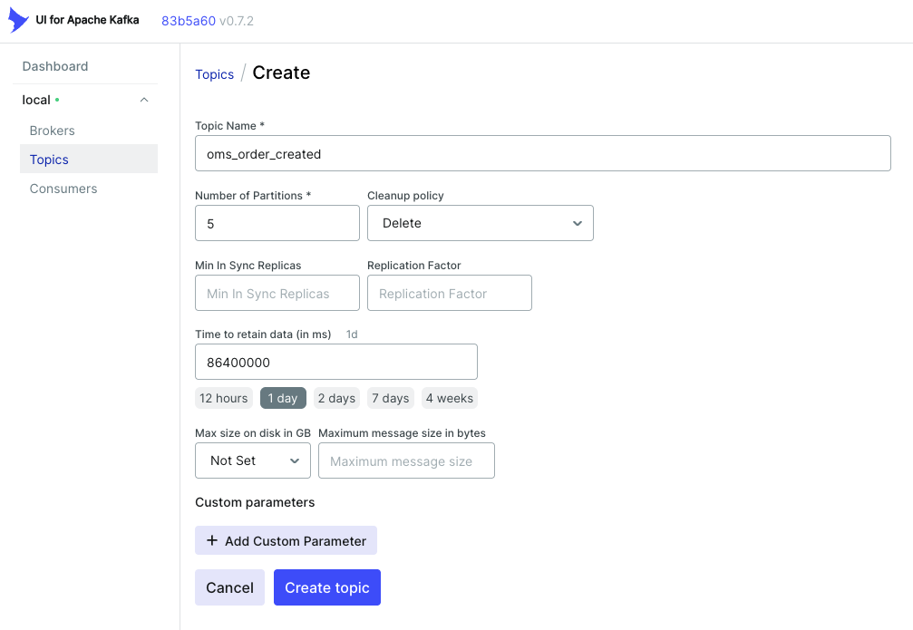
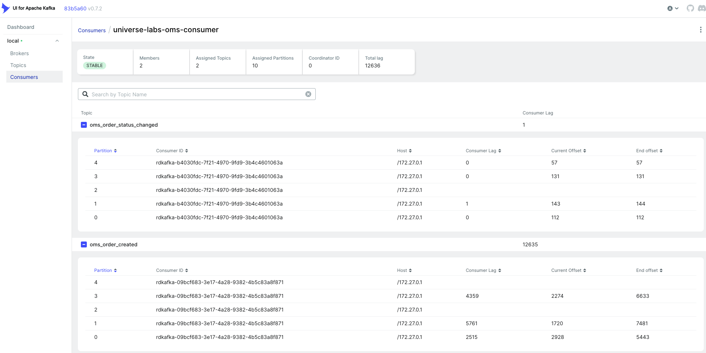

# Лаба 5
### Apache Грефневая Kafka

> Введение

А теперь мы будем делать настоящий продакшн, ибо RabbitMQ уже много где заменили на Kafka.
Почему? Потому что Kafka - это крутое решение, которое позволяет обрабатывать огромное количество сообщений в реальном времени.
Чего не сказать про RabbitMQ, ибо под 100 000 RPS кролик складывается.

> #### Оффтоп для мальчиков
Представьте, что у вас BMW M Competition (напичканный электроникой для упрощения вождения),
в которой из коробки идет выравнивание по полосе, панель управления, круиз контроль,
разгон до 100км/ч за 4 секунды и остальные достижения современного автомобилестроения.

Так вот. Пересаживание с RabbitMQ на Kafka - это то же самое, как пересесть
с бмв на батину бэху, которая старше вас и в которой из электрического только дворники и магнитола.

Вам придется писать очень много инфраструктурного кода, ибо библиотека от Confluent - нищая.
Более того:
- О каких обменниках и очередях идет речь? Тут у нас только топики и партиции `[круиз контроль? у нас только буксир есть]`
- Никто тебе не скажет, что сообщение пришло в партицию, сам приходи и спрашивай `[глохнет, когда трогаешься с места? у нас карбюратор, качай икры]`
- Если хочешь запаблишить сообщение, будь добр указать, по какой стратегии оно должно зароутиться в нужный partition `[робот/вариатор/акпп? не, не слышали, у нас расход бензина меньше]`
- Очень сложен в настройке для DevOps-ов, легко положить прод из-за ошибки в конфиге `[полное внимание на КПП/педали/знаки на дороге/светофоры/сигналы]`

Однако бэхе уже более 20 лет, и она не ломается (в отличие от современного аналога), потому что все устроенно просто и топорно. Прям как в Kafka.

> #### Оффтоп для девочек
Представьте, что у вас стайлер Dyson (напичканный электроникой для упрощения сушки и укладки волос), который
можно использовать как фен для сушки волос без экстремальных температур, щетку-брашинг, плойку, утюжок для выпрямления волос, инструмент создания объема и средство для раглаживания пушистости.
И притом можно работать 1-й рукой и подключить его к приложению.

Так вот. Пересаживание с RabbitMQ на Kafka - это то же самое, как пересесть с Dyson на
старый фен 90-х годов, в котором из простого - это воткнуть вилку в розетку.

Вам придется писать очень много инфраструктурного кода, ибо библиотека от Confluent - нищая.
Более того:
- О каких обменниках и очередях идет речь? Тут у нас только топики и партиции `[сушка/укладка/выравнивание/создание объема? у нас только сушка/сушка/сушка/сушка]`
- Никто тебе не скажет, что сообщение пришло в партицию, сама приходи и спрашивай `[долго сушатся волосы? ну помоги расческой, чтобы корни просушились]`
- Если хочешь запаблишить сообщение, будь добра указать, по какой стратегии оно должно зароутиться в нужный partition `[разные режимы работы? у нас только вкл/выкл есть]`
- Очень сложен в настройке для DevOps-ов, легко положить прод из-за ошибки в конфиге `[если уронить фен в воду, случится короткое замыкание]`

Однако этому фену уже 20 лет и он ни разу не ломался (в отличие от современного аналога), потому что все устроенно просто и топорно. Прям как в Kafka.

#
Погнали?
А вот и офф. сайт подьехал
https://kafka.apache.org

> НЕ РЕКЛАМА!

Вообще рекомендую ознакомиться с продуктами фонда Apache, ребята делают очень много крутых вещей. И притом распространяют их бесплатно.
В множестве вакансиий могут присутствовать требования к знаниям продуктов Apache, вот некоторые из них:
- Kafka
- Zookeeper
- Hadoop
- Spark
- Hive
- HBase
- Cassandra
- Airflow
- Lucene

Если вы джавист/котлинист, то вы точно знакомы с:
- Tomcat
- Ant
- Maven
- NetBeans

И это тоже сделали они. У ребят 320+ проектов, которые они продолжают развивать.

1. У кафки нет встроенной админки, поэтому поднимем два контейнера в `docker-compose.yml`:
```yaml
services:
  # ...
  # тут ваша секция про postgres и pgbouncer
  # ...
  kafka:
    image: apache/kafka:4.0.0
    restart: always
    container_name: kafka
    ports:
      - "9092:9092"
      - "9093:9093"
    environment:
      - KAFKA_NODE_ID=1
      - KAFKA_PROCESS_ROLES=broker,controller
      - KAFKA_LISTENERS=PLAINTEXT://:29092,CONTROLLER://:9093,EXTERNAL://:9092
      - KAFKA_ADVERTISED_LISTENERS=PLAINTEXT://kafka:29092,EXTERNAL://localhost:9092
      - KAFKA_CONTROLLER_LISTENER_NAMES=CONTROLLER
      - KAFKA_LISTENER_SECURITY_PROTOCOL_MAP=CONTROLLER:PLAINTEXT,EXTERNAL:PLAINTEXT,PLAINTEXT:PLAINTEXT
      - KAFKA_CONTROLLER_QUORUM_VOTERS=1@kafka:9093
      - KAFKA_OFFSETS_TOPIC_REPLICATION_FACTOR=1
      - KAFKA_TRANSACTION_STATE_LOG_REPLICATION_FACTOR=1
      - KAFKA_TRANSACTION_STATE_LOG_MIN_ISR=1
      - KAFKA_GROUP_INITIAL_REBALANCE_DELAY_MS=0
      - KAFKA_LOG_DIRS=/var/lib/kafka/data
      - CLUSTER_ID=universe-labs-cluster
    volumes:
      - ./kafka-data:/var/lib/kafka/data

  kafka-ui:
    image: provectuslabs/kafka-ui:latest
    restart: always
    container_name: kafka-ui
    ports:
      - "8180:8080"
    depends_on:
      - kafka
    environment:
      - KAFKA_CLUSTERS_0_NAME=local
      - KAFKA_CLUSTERS_0_BOOTSTRAPSERVERS=kafka:29092

volumes:
  pgdata:
  kafka_data:
```

Видите, как много настроек у кафки? Лучше почитать про наиболее популярные настройки,
чтобы понимать, как с ней работать с точки зрения бэкэнда. https://hub.docker.com/r/bitnami/kafka#:~:text=compose%20up%20%2Dd-,Configuration,-Environment%20variables

Секцию с RabbitMQ можно удалить.

2. Поднимем контейнеры и посмотрим в UI по адресу `http://localhost:8180/`
   

Сейчас у нас нет топиков и консьюмеров, поэтому в соответствующих секциях ничего нет.

Далее работаем с проектом `UniverseLabs.Oms`.
3. Удаляем нугет пакет RabbitMQ.Client и устанавливаем новый пакет Confluent.Kafka 2.11.1 или выше.
4. Удаляем класс `RabbitMqSettings.cs`, секции в `appsettings.Development.json`/`appsettings.Production.json`,
   `RabbitMqService.cs`.
5. Добавляем новый класс в папку Config `KafkaSettings.cs`:
```csharp
public class KafkaSettings
{
    public string BootstrapServers { get; set; }

    public string ClientId { get; set; }
    
    public string OmsOrderCreatedTopic { get; set; }
    
    public string OmsOrderStatusChangedTopic { get; set; }
}
```

6. Добавляем новую секцию в `appsettings.Development.json`:
```json
{
  "KafkaSettings": {
    "BootstrapServers": "localhost:9092",
    "ClientId": "universe-labs-oms",
    "OmsOrderCreatedTopic": "oms_order_created",
    "OmsOrderStatusChangedTopic": "oms_order_status_changed"
  }
}
 ```

7. Пишем кафка-продьюсера:
```csharp
public class KafkaProducer
{
    private readonly IProducer<string, string> _producer;
    
    public KafkaProducer(IOptions<KafkaSettings> kafkaSettings)
    {
        var config = new ProducerConfig
        {
            BootstrapServers = kafkaSettings.Value.BootstrapServers,
            ClientId = kafkaSettings.Value.ClientId,
            LingerMs = 100,
            CompressionType = CompressionType.Snappy,
            Partitioner = Partitioner.Consistent
        };
        
        _producer = new ProducerBuilder<string, string>(config).Build();
    }

    public async Task Produce<T>(string topic, (string key, T message)[] messages, CancellationToken token)
    {
        var tasks = messages.Select(async message =>
        {
            try
            {
                return await _producer.ProduceAsync(topic, 
                    new Message<string, string>
                    {
                        Key = message.key,
                        Value = message.message.ToJson()
                    }, token);
            }
            catch (ProduceException<string, string> ex)
            {
                Console.WriteLine($"Failed to send message: {ex.Error.Reason}");
                return null;
            }
        });

        var results = await Task.WhenAll(tasks);
        
        if (results.Any(x => x is null))
        {
            throw new Exception("Failed to produce messages");
        }
    }
}
```

> NB! ProducerConfig имеет массу настроек, которые влияют как, когда и куда будет публиковаться событие. Сейчас у нас большинство настроек выбраны по умолчанию.

Пройдемся по имеющимся:
- BootstrapServers - адрес брокера кафки
- ClientId - идентификатор клиента
- LingerMs - время ожидания перед отправкой батча (ждем 100 мс, если батч заполнился раньше - пушим его в кафку, если нет - пушим, что есть)
- CompressionType - тип сжатия (Snappy более-менее оптимальный)
- Partitioner - стратегия разбиения по партициям, всегда по ключу (в нашем случае берется консистентый хэш ключа)

Если ключ один и тот же для двух сообщений, то они гарантировано попадут в одну партицию.

8. Можем удалить RoutingKey из событий, т.к. он больше не используется.
9. Зарегистрируем зависимости в `Program.cs`.
10. Перепишем сам паблиш в OrderService.cs. Только теперь надо прокинуть ключ
    для каждого события, рекомендую взять за ключ `CustomerId`, чтобы события по заказам
    одного и того же пользователя попадали в одну партицию. Это нужно, чтобы не потерять очередность,
    и чтобы один и тот же консьюмер читал события по этому пользователю.
11. Перепишем `OrderGenerator.cs`. Пусть теперь он берет CustomerId из определенного пула размером, например, 5 айдишников.
12. Теперь в Kafka UI создадим топики `oms_order_created` и `oms_order_status_changed` c такими параметрами:
    


13. Запустим приложение и посмотрим в Kafka UI на топик `oms_order_created`.
    
    


14. Все работает, как мы и хотели, сообщения с одинаковыми ключами попадают в одну и ту же партицию.
15. В проекте UniverseLabs.Oms.Consumer удаляем нугет пакет RabbitMQ.Client и устанавливаем новый пакет Confluent.Kafka 2.11.1 или выше.
16. Удаляем класс `RabbitMqSettings.cs`, секции в `appsettings.Development.json`/`appsettings.Production.json`
17. Пишем новый KafkaSettings.cs:
```csharp
public class KafkaSettings
{
    public string BootstrapServers { get; set; }
    
    public string GroupId { get; set; }
    
    public string OmsOrderCreatedTopic { get; set; }
    
    public string OmsOrderStatusChangedTopic { get; set; }
}
```

18. Добавляем новую секцию в `appsettings.Development.json`:
```json
{
  "KafkaSettings": {
    "BootstrapServers": "localhost:9092",
    "GroupId": "universe-labs-oms-consumer",
    "OmsOrderCreatedTopic": "oms_order_created",
    "OmsOrderStatusChangedTopic": "oms_order_status_changed"
  }
}
```

19. Пишем новый базовый консьюмер `BaseKafkaConsumer.cs`:
```csharp
public abstract class BaseKafkaConsumer<T>: IHostedService
    where T : class
{
    private readonly IConsumer<string, string> _consumer;
    private readonly ILogger<BaseKafkaConsumer<T>> _logger;
    private readonly string _topic;
    
    protected BaseKafkaConsumer(
        IOptions<KafkaSettings> kafkaSettings,
        string topic,
        ILogger<BaseKafkaConsumer<T>> logger)
    {
        var config = new ConsumerConfig
        {
            BootstrapServers = kafkaSettings.Value.BootstrapServers,
            GroupId = kafkaSettings.Value.GroupId,
            AutoOffsetReset = AutoOffsetReset.Latest,
            EnableAutoCommit = true,
            AutoCommitIntervalMs = 5_000,
            SessionTimeoutMs = 60_000,
            HeartbeatIntervalMs = 3_000,
            MaxPollIntervalMs = 300_000
        };

        _logger = logger;
        _topic = topic;
        _consumer = new ConsumerBuilder<string, string>(config).Build();
    }
    
    public async Task StartAsync(CancellationToken cancellationToken)
    {
        await StartConsuming(_topic, cancellationToken);
    }

    public Task StopAsync(CancellationToken cancellationToken)
    {
        StopConsuming();
        return Task.CompletedTask;
    }

    private async Task StartConsuming(string topic, CancellationToken cancellationToken)
    {
        _consumer.Subscribe(topic);
        _logger.LogInformation($"Started consuming from topic: {topic}");

        try
        {
            while (!cancellationToken.IsCancellationRequested)
            {
                var consumeResult = _consumer.Consume(cancellationToken);

                var msg = new Message<T>
                {
                    Key = consumeResult.Message.Key,
                    Body = consumeResult.Message.Value.FromJson<T>()
                };
                
                if (consumeResult.Message != null)
                {
                    try
                    {
                        await ProcessMessage(msg, cancellationToken);
                        _consumer.Commit(consumeResult);
                    }
                    catch (Exception e)
                    {
                        _logger.LogError(e, "Error processing message");
                    }
                }
            }
        }
        catch (OperationCanceledException)
        {
            _logger.LogInformation("Consumer cancelled");
        }
        catch (ConsumeException ex)
        {
            _logger.LogError(ex, "Consume error occurred");
        }
        finally
        {
            StopConsuming();
        }
    }
    
    private void StopConsuming()
    {
        _logger.LogInformation($"Stopping consuming from topic: {_topic}");
        _consumer.Close();
        _consumer.Dispose();
    }

    protected abstract Task ProcessMessage(Message<T> message, CancellationToken token);
}
```

20. Класс `MessageInfo.cs` переименуйте в `Message.cs`:
```csharp
public class Message<T>
{
    public string Key { get; set; }
    
    public T Body { get; set; }
}
```

21. Теперь перепишите консьюмеры `OmsOrderCreatedConsumer.cs` и `OmsOrderStatusChangedConsumer.cs`, учтите, что они не батчевые.
22. Также не забудьте добавить в `Program.cs` следующий код - это позволит запустить консьюмеры параллельно:
```csharp
builder.Services.Configure<HostOptions>(options =>
{
    options.ServicesStartConcurrently = true;
    options.ServicesStopConcurrently = true;
});
```
22. Запустите проект и посмотрите в UI спустя пару минут. Откройте вкладку Consumers и убедитесь, что консьюмер с названием universe-labs-oms-consumer подключился к очереди.
    

Видите в топике `oms_order_created` лаг? Это значит, что консьюмер не успевает за продьюсером.

23. Самостоятельно пишем батчевый вариант. Начинаем с `BaseBatchKafkaConsumer.cs`. Заканчиваем
    `BatchOmsOrderCreatedConsumer.cs` и `BatchOmsOrderStatusChangedConsumer.cs`.
    Не забудьте в конфиге задать `CollectBatchSize` и `CollectTimeoutMs`.

24. Когда вы напишете батчевые консьюмеры, обратите внимание, как быстро они будут разгребать лаг.
    Мой эксперимент показал, что лаг в 100 000 сообщений батчевый консьюмер с параметрами
```json
{
  "CollectBatchSize": 100,
  "CollectTimeoutMs": 500
}
```
разгреб за 40 секунд. По сравнению с кроликом - это очень быстро.