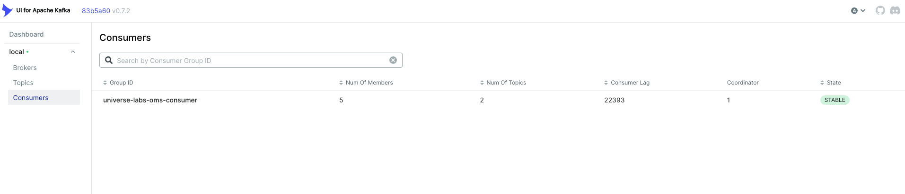

# Лаба 6
### Apache Kafka

> Введение

По прошлой лабе мы поняли, что кафка в целом производительнее чем кролик (если вы написали батчевый консьюмер для неё).
Однако устойчивость системы необходимо закладывать самому.
В частности выключение автокоммитов, ретраи, DLQ и прочее необходимо реализовать в вашем приложении,
поддержки такого функционала в кафке нет.

На самом деле понятие DLQ вообще не существует для кафки, вы просто создаете такую же очередь, как и ваша,
только в название дописывается постфикс `***_error`.
Никакого роутинга и биндинга тут в помине нет. Вы сами должны пушить событие при неудачной обработке.

Балансировка также реализуется иначе. В кролике вы к одной очереди подключали несколько консьюмеров, и брокер сам
раздавал события каждому из подписчиков.

В кафке же отсутсвует понятие `очередь`, есть только `топики` и `партиции`.

> Максимальное кол-во консьюмеров для одного топика равно количеству партиций.

То есть вам надо сразу закладывать такое кол-во партиций, которое удовлетворит вашу будущую нагрузку.

Вы можете спросить: `а почему я не могу подключить к 10 партициям 20 консьюмеров?`

Ответ: `можно хоть 10 консьюмеров на партицию, а толку?`

Кафка гарантирует очередность сообщений, поэтому если у вас 2 консьюмера читают одну и ту же партицию,
то пока первый не вызвал `commit`, второй ничего не получит в обработку.
То есть у вас всегда один из консьюмеров простаивает. Тогда смысл его поднимать?

Погнали дальше делать HighLoad!

1. Для начала давайте рассмотрим бОльшую часть настроек продьюсера:
   Основные настройки надежности
- `EnableIdempotence` — гарантирует, что сообщения будут доставлены ровно один раз в правильном порядке. При значении true автоматически настраиваются: max.in.flight.requests.per.connection=5, retries=INT32_MAX и acks=all.
- `MessageSendMaxRetries` — количество попыток повторной отправки при ошибке (по умолчанию 2147483647). Повторные попытки могут нарушить порядок сообщений, если не включена идемпотентность.
- `MessageTimeoutMs` — максимальное время ожидания успешной доставки сообщения в миллисекундах (по умолчанию 300000). Это общий таймаут для всех попыток доставки, включая повторы.
- `BatchSize` — максимальный размер пакета сообщений в байтах. Больший размер батча улучшает производительность за счет меньшего количества запросов.
- `LingerMs` — задержка в миллисекундах перед отправкой батча для накопления большего количества сообщений (по умолчанию 5). Увеличение значения улучшает сжатие и производительность, но увеличивает латентность.
- `BatchNumMessages` — максимальное количество сообщений в одном батче (по умолчанию 10000).
- `QueueBufferingMaxMessages` — максимальное количество сообщений в очереди продюсера (по умолчанию 100000). Эта очередь общая для всех топиков и партиций.
- `QueueBufferingMaxKbytes` — максимальный размер очереди в килобайтах (по умолчанию 1048576). Этот параметр имеет приоритет над QueueBufferingMaxMessages.
- `QueueBufferingBackpressureThreshold` — порог неотправленных запросов для создания обратного давления (по умолчанию 1). Меньшее значение создает более крупные и эффективные батчи.
- `CompressionType` — тип сжатия для всех данных: none, gzip, snappy, lz4, zstd (по умолчанию none). Сжатие работает на уровне батчей, поэтому эффективность зависит от размера батча.
- `CompressionLevel` — уровень сжатия для выбранного алгоритма (значения зависят от алгоритма).
- `Partitioner` — стратегия распределения сообщений по партициям. Доступные варианты: random, consistent, consistent_random (по умолчанию), murmur2, murmur2_random, fnv1a, fnv1a_random.
- `StickyPartitioningLingerMs` — задержка для назначения sticky-партиций сообщениям без ключа (по умолчанию 10).
- `RequestTimeoutMs` — таймаут подтверждения запроса продюсера брокером в миллисекундах (по умолчанию 30000).
- `EnableGaplessGuarantee` — экспериментальная настройка для предотвращения пропусков в последовательности сообщений (требует EnableIdempotence=true).

2. При высокой нагрузке рекомендуется устанавливать следующие параметры:
- `BatchSize` - больший размер батча уменьшает количество сетевых запросов и повышает throughput за счет объединения большего количества сообщений в одну отправку.
- `LingerMs` рекомендуется установить в диапазоне 10-50 миллисекунд вместо дефолтного 0. Эта небольшая искусственная задержка позволяет накопить больше сообщений в батче, существенно повышая пропускную способность при незначительном росте latency.
- `BatchNumMessages` можно увеличить с дефолтных 10000 до 50000-100000 для потоков с высокой частотой генерации сообщений.
- `CompressionType` - на выбор snappy/lz4/zstd. Баланс обеспечивает последний кандидат, т.к. тут высокий уровень компрессии и неплохая скорость сжатия и распаковки (около 1 ГБ/с)
- `MaxInFlight` - целое число, определяющее кол-во параллельных отправок в брокер. Значения больше 1 могут нарушить порядок сообщений при повторных попытках, поэтому для процессов, требующих строгой упорядоченности, следует оставить значение 1 или включить идемпотентность.
- `Acks` - подтверждение только от лидера или от всех реплик брокера. При первом варианте возможны потери сообщений, но повышается пропускная способность, поэтому для процессов, требующих гарантий, следует оставить значение 2 (подтверждение от всех реплик) или включить идемпотентность.
- `QueueBufferingMaxMessages` - рекомендуется увеличить до 500000-1000000 для высоконагруженных приложений. Это позволяет продюсеру аккумулировать больше сообщений при временных всплесках нагрузки без блокировки.

> Огромная нагрузка: BatchSize=131072, LingerMs=20-50, CompressionType=Lz4, Acks=Leader, MaxInFlight=5-10, QueueBufferingMaxMessages=500000

> Надежность: BatchSize=65536, LingerMs=5, CompressionType=Snappy, Acks=All, EnableIdempotence=true, MaxInFlight=1, MessageSendMaxRetries=100000, RetryBackoffMs=1000, MessageTimeoutMs=120000

> Баланс: BatchSize=65536, LingerMs=10, CompressionType=Zstd, Acks=All, EnableIdempotence=true, MaxInFlight=5

Также для баланса и для надежности необходимо в параметрах создания топика задать min.insync.replicas >= 2 и replication factor = 3, иначе Acks=All не несет никакой смысловой нагрузки.
Однако в нашем лабораторном случае используется всего лишь 1 брокер, поэтому replication factor = 3 мы установить не сможем. Обычно установкой таких вещей занимаются DevOps-ы.
Мы же будем устанавливать min.insync.replicas = 2, replication factor = 1.

3. Создаем (или удаляем имеющиеся и создаем новые) топики `oms_order_created` и `oms_order_status_changed`.
   В каждом топике задаем 3 партишна и min.insync.replicas = 2, replication factor = 1.

4. В настройках продьюсера в файле `KafkaProducer.cs` зададим новые настройки (уберем автокоммит):
```csharp
var config = new ProducerConfig
{
    BootstrapServers = kafkaSettings.Value.BootstrapServers,
    ClientId = kafkaSettings.Value.ClientId,
    CompressionType = CompressionType.Snappy,
    Partitioner = Partitioner.Consistent,
    Acks = Acks.All,
    EnableIdempotence = true,
    LingerMs = 5,
    BatchSize = 16384,
    MaxInFlight = 1
};
```

> Вынесите все эти параметры в `KafkaSettings.cs` и заполните их в `appsettings.Development.json`.

5. Теперь давайте замерим производительность наших пушей. Для начала изменим `OrderGenerator.cs`.
   Сейчас там создается 50 заказов и делается по ним инсерт, а далее апдейт. Давайте создадим 500 заказов, далее в цикле от 0 до 200
   будем делать инсерт этих самых 500 заказов без задержек. Необходимо, чтобы в топике появилось 100 000 событий.
   Также необходимо замерить время выполнения всех этих пушей, для этого в C# есть класс Stopwatch:
```csharp
var sw = new Stopwatch();
sw.Start();

for (var i = 0; i < 200; i++)
{
    await orderService.BatchInsert(orders, stoppingToken);
}

Console.WriteLine(sw.Elapsed);
```
После инсерта 100 000 заказов в консоль будет выведено время.
У меня это время было равно `9 секунд 647 мс`.

6. Теперь поменяем конфигурацию. Опять же в настройках продьюсера в файле `KafkaProducer.cs` зададим новые настройки:
```csharp
var config = new ProducerConfig
{
    BootstrapServers = kafkaSettings.Value.BootstrapServers,
    ClientId = kafkaSettings.Value.ClientId,
    CompressionType = CompressionType.Snappy,
    Partitioner = Partitioner.Consistent,
    Acks = Acks.All,
    LingerMs = 10,
    BatchSize = 65536,
    EnableIdempotence = true,
    MaxInFlight = 5
};
```

> Вынесите новые параметры также в `KafkaSettings.cs` и заполните их в `appsettings.Development.json`.

7. Запускаем приложение и замеряем время. В моем случае было `7 секунд 318 мс`. Ускорение на **20-25%** благодаря увеличению `BatchSize/LingerMs/MaxInFlight` достигнуто.

8. Реализуем интерфейс IDisposable для `KafkaProducer.cs`. В конце класса добавим методы для очистки ресурсов:
```csharp

public class KafkaProducer: IDisposable
{
    private readonly IProducer<string, string> _producer;
    // ...
    // Тут основной код продьюсера
    // ...

    private bool _disposed;

    public void Dispose()
    {
        if (_disposed) return;
        _disposed = true;

        Dispose(true);
        GC.SuppressFinalize(this);
    }

    protected virtual void Dispose(bool disposing)
    {
        if (!disposing)
        {
            return;
        }
        
        try
        {
            _producer.Flush(); 
            _producer.Dispose();
        }
        catch (Exception e)
        {
            // ignore
        }
    }
```

Что нам это дает? В случае редеплоя или окончания http-реквеста скоуп заканчивается и объект удаляется из памяти.
Перед его удалением, необходимо допушить все события в брокер, чтобы ничего не потерялось.

9. Теперь проведем эксперимент по сжатию.
   Для начала удалим и создадим топики заново. Оставим всё как есть и запустим наше приложение.
   По моим замерам вышло чуть более 7 секунд (7.318) и 18 МБ - размер топика `oms_order_created`.  
   Размер топика можно подсмотреть в разделе Topic в Kafka UI.
10. Поменяем тип сжатия на Lz4. Удалим и создадим топики заново. Запустим приложение.
    По моим замерам вышло чуть более 7 секунд (7.424) и 17 МБ - размер топика `oms_order_created`.
    Да, мы чутка проиграли в скорости (1%), но выиграли по памяти более 5%.

11. Еще раз поменяем тип сжатия, на этот раз Zstd. Удалим и создадим топики заново. Запустим приложение.
    По моим замерам вышло чуть более 7 секунд (7.532) и 9 МБ - размер топика `oms_order_created`.
    По сравнению с Lz4 или Snappy проигрыш по времени не критичен, мы можем простить эти 1-2%.
    Однако по памяти выигрыш почти в 2 раза, что не может не радовать отделы DevOps и SRE.

12. Теперь перейдем к настройкам консьюмера. Вот основные:
- `BootstrapServers` — список адресов Kafka-брокеров для первоначального подключения (например, "localhost:9092"). Это обязательный параметр для установления соединения с кластером.
- `GroupId` — идентификатор consumer group, к которой принадлежит консьюмер. Все консьюмеры с одинаковым GroupId образуют группу и совместно обрабатывают партиции топика, обеспечивая распределение нагрузки. Это критически важный параметр для координации работы нескольких консьюмеров.
- `ClientId` — произвольный идентификатор клиента для логирования и метрик. Помогает отслеживать активность конкретного консьюмера в логах брокера.
- `AutoOffsetReset` — определяет поведение при отсутствии сохраненного офсета или если офсет стал невалидным. Значение Earliest начинает чтение с самого начала топика, Latest — только с новых сообщений, Error — выбрасывает исключение.
- `EnableAutoCommit` — автоматически фиксирует офсеты в фоновом потоке через определенные интервалы (по умолчанию true). При значении true консьюмер периодически коммитит офсеты в Kafka без явных вызовов из кода.
- `AutoCommitIntervalMs` — интервал в миллисекундах между автоматическими коммитами офсетов (по умолчанию 5000). Работает только при EnableAutoCommit=true.
- `EnableAutoOffsetStore` — автоматически помечает офсет готовым к коммиту сразу перед вызовом Consume (по умолчанию true). При включенной настройке офсет сохраняется до обработки сообщения, что может привести к потере сообщений при сбое.
- `SessionTimeoutMs` — таймаут сессии консьюмера в миллисекундах (по умолчанию 10000). Если брокер не получает heartbeat в течение этого времени, он считает консьюмер недоступным и запускает ребалансировку партиций.
- `HeartbeatIntervalMs` — интервал между heartbeat-сообщениями координатору consumer group (по умолчанию 3000). Обычно устанавливается в треть от SessionTimeoutMs.
- `MaxPollIntervalMs` — максимальный интервал между вызовами Consume() (по умолчанию 300000). Если консьюмер не вызывает Consume() в течение этого времени, он считается неактивным и исключается из группы.

Стратегии обработки событий:
- `At-Most-Once` (максимум один раз) достигается при дефолтной конфигурации с EnableAutoCommit=true и EnableAutoOffsetStore=true. В этом случае офсет коммитится до завершения обработки, и при сбое сообщение может быть потеряно.
- `At-Least-Once` (минимум один раз) требует ручного управления коммитами. Установите EnableAutoCommit=false и вызывайте Commit() только после успешной обработки сообщения. При сбое сообщение может быть обработано повторно.
- `Exactly-Once` (ровно один раз) для stream processing (kafka → kafka) доступна начиная с версии 1.4 при использовании транзакций

Нас интересует 2-й вариант - At Least Once.

13. В проекте с косьюмером зададим параметры для ConsumerConfig-a в `BaseBatchKafkaConsumer.cs`:
```csharp
var config = new ConsumerConfig
{
    BootstrapServers = kafkaSettings.Value.BootstrapServers,
    GroupId = kafkaSettings.Value.GroupId,
    AutoOffsetReset = AutoOffsetReset.Latest,
    EnableAutoCommit = false,
    SessionTimeoutMs = 60_000,
    HeartbeatIntervalMs = 3_000,
    MaxPollIntervalMs = 300_000
};
```

Также не забываем вызвать `_consumer.Commit(last);` после успешной обработки событий.
last - это последнее сообщение в батче (его надо запомнить во время консьюма событий из брокера).

> Вынесите все параметры для ConsumerConfig в `KafkaSettings.cs` и заполните их в `appsettings.Development.json`.


14. Теперь давайте понагружаем наше приложение. У нас есть `OrderGenerator.cs`. Он делал до сегодняшней лабы Insert 50 заказов, потом ждал 100 мс
    и делал апдейт статусов нескольких заказов. Потом ждал 250 мс и шел на второй круг.
    Давайте немножно это подтюним. Вернем всё как было ДО и начнем делать батчевый инсерт 1000 заказов, потом будет апдейт без задержки.
    И после чего пойдем на второй круг.

После чего запускаем приложения (и сервис, и консьюмер) и видим, как растет лаг.


15. Давайте создадим топики с Number of Partitions = 3, Min In Sync Replicas = 2, Replication Factor = 1.
    Теперь можно честно сделать скейлинг консьюмеров.
16. Запускаем приложения (и сервис, и консьюмера), далее скейлим консьюмера до 3-х штук.
    Если вы запускаете в докере (через `docker-compose.yml`), то можно вызвать команду

`docker compose up --scale universe-labs-consumer=3 -d`

> NB! Если чувствуете, что ваши консьюмеры все равно не справляются, то увеличьте CollectBatchSize для них.

> NB! Может быть такое, что на вашем ноутбуке выдано слишком мало CPU/MEM для докера. Выставите значение побольше, чтобы контейнеры обслуживались без задержек.