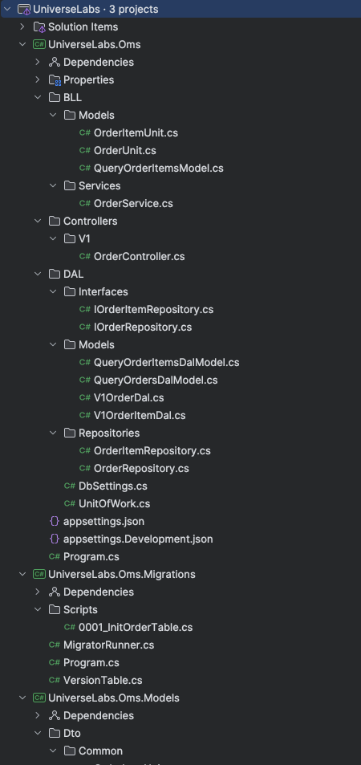

# Лаба 1

### Создание WebApi на ASP.NET Core + Postgres

0) Глоссарий:
- ASP.NET Core - фреймворк для создания веб-приложений на языках, поддерживаемых платформой .NET
- Миграции - способ накатки изменений в базу данных до старта/на старте приложения
- Ручка - эндпоинт веб-приложения, который обрабатывает запросы пользователя (action в контроллере)
- Nuget-пакет - библиотека, предоставляемая внешними разработчиками
- Солюшн - файл-агрегации проектов, который компанует проекты в одну сборку
- Проджект - проект (по сути папка в солюшне с файлом в корне ***.csproj), содержащий классы и настройки конкретного приложения
    - class library - библиотека, содержащая классы, используемые в других проектах
    - console app - консольное приложение
    - web app - веб-приложение с ручками

> Рекомендую использовать IDE от JetBrains Rider, он доступен по политике Non-commercial use.
> Но можно использовать Visual Studio или Visual Studio Code (они тоже бесплатные, однако в них тулинг намного хуже)


1) Создаем проект с солюшном по шаблону WebApi (.net 9)
2) Добавляем в солюшн два проекта Models и Migrations. Models (class library) - для общих моделей, Migrations (console app) - для миграций базы данных
3) В проект с миграциями добавляем следующие нугет пакеты:
```
FluentMigrator 6.2.0
FluentMigrator.Runner 6.2.0
FluentMigrator.Runner.Postgres 6.2.0
Microsoft.Extensions.Configuration 9.0.0
Microsoft.Extensions.Configuration.FileExtensions 9.0.0
Microsoft.Extensions.Configuration.Json 9.0.0
Microsoft.Extensions.DependencyInjection 9.0.0
Npgsql 9.0.3
```

4) Также в проект с миграциями добавляем следующие классы:
>Program.cs - точка входа для запуска миграций
```csharp
public static class Program
{
    public static void Main(string[] args)
    {
        if (args.Contains("--dryrun"))
        {
            return;
        }

        // Получаем переменную среды, отвечающую за окружение
        var environmentName = Environment.GetEnvironmentVariable("ASPNETCORE_ENVIRONMENT") ??
                              throw new InvalidOperationException("ASPNETCORE_ENVIRONMENT in not set");

        // собираем конфигурацию на основании окружения
        // у нас будет два варианта - Development/Production
        var config = new ConfigurationBuilder()
            .SetBasePath(Directory.GetCurrentDirectory())
            .AddJsonFile($"appsettings.{environmentName}.json")
            .Build();

        // Получаем строку подключения из конфига `appsettings.{Environment}.json`
        var connectionString = config["DbSettings:MigrationConnectionString"];
        var migrationRunner = new MigratorRunner(connectionString);
        
        // Мигрируемся
        migrationRunner.Migrate();
    }
}
```
> MigratorRunner.cs - конфигурация раннера миграций
```csharp
public class MigratorRunner(string connectionString)
{
    public void Migrate()
    {
        var serviceProvider = CreateServices();

        using var scope = serviceProvider.CreateScope();
        UpdateDatabase(serviceProvider.GetRequiredService<IMigrationRunner>());
    }

    private IServiceProvider CreateServices()
    {
        Console.WriteLine(typeof(MigratorRunner).Assembly.FullName);
        
        // Зависимости
        // Хотим fluentMigrator с постгресом
        // и чтобы искал миграции в текущем проекте.
        // Также добавляем консольное логирование и
        // собственную реализацию интерфейса IVersionTableMetaData 
        // (которая хранит накаченные миграции) 
        return new ServiceCollection()
            .AddFluentMigratorCore()
            .ConfigureRunner(rb => rb
                .AddPostgres()
                .WithGlobalConnectionString(connectionString)
                .ScanIn(typeof(MigratorRunner).Assembly).For.Migrations())
            .AddLogging(lb => lb.AddFluentMigratorConsole())
            .AddScoped<IVersionTableMetaData, VersionTable>()
            .BuildServiceProvider(false);
    }

    private void UpdateDatabase(IMigrationRunner runner)
    {
        // Мигрируем базу
        runner.MigrateUp();
        // создаем и открываем коннект к бд
        using var connection = new NpgsqlConnection(connectionString);
        connection.Open();
        // перегружаем композитные типы
        connection.ReloadTypes();
    }
}
```
>VersionTable.cs - состав таблицы для хранения версий миграций
```csharp
public class VersionTable : IVersionTableMetaData
{
    public bool OwnsSchema => true;

    public string SchemaName => "public";

    public string TableName => "version_info";

    public string ColumnName => "version";

    public string DescriptionColumnName => "description";

    public string AppliedOnColumnName => "applied_on";

    public bool CreateWithPrimaryKey { get; } = false;

    public string UniqueIndexName => "uc_version";
}
```

Далее создаем папку Scripts, в которой будут храниться сами миграции
> Этот код будет копироваться из проекта в проект, нужен только там, где есть база данных 

5) Переходим в проект WebApi и добавляем следующие нугет пакеты:
```
Dapper 2.1.6
FluentValidation 11.11.0
FluentValidation.AspNetCore 11.3.0
Swashbuckle.AspNetCore 7.3.1
```
6) Также добавляем ссылки на проекты Models и Migrations в проект WebApi
> Класс Program.cs нужен для регистрации зависимостей в контейнере Dependency Injection (IoC)

7) Добавляем в папку с солюшном файл docker-compose.yml следующего содержания
```yaml
services:
  postgres:
    image: postgres
    environment:
      - POSTGRES_USER=user
      - POSTGRES_PASSWORD=mypassword
      - POSTGRES_DB=postgres
      - POSTGRES_HOST_AUTH_METHOD=md5
      - POSTGRES_INITDB_ARGS=--auth=md5
    volumes:
      - pgdata:/var/lib/postgresql/data/
      - ./initdb.d:/docker-entrypoint-initdb.d
  
  pgbouncer:
    image: edoburu/pgbouncer:latest
    environment:
      - DB_HOST=postgres
      - DB_PORT=5432
      - DB_USER=user
      - DB_PASSWORD=mypassword
      - ADMIN_USERS=postgres,admin
    ports:
      - "15432:5432"
  
volumes:
  pgdata:
```
Помимо контейнера postgres можно увидеть дополнительный контейнер pgbouncer. 
Он нужен для проксирования запросов в базу с целью уменьшения кол-ва долгоживущих коннектов в пуле коннектов.
> Почему так сделано? Каждый коннект в postgres стоит 10 МБ оперативной памяти. 
Если включить пулинг коннектов, то некоторое время в пуле может быть, например, 40 живых коннектов, которые
будут стоить 400 МБ оперативной памяти.
Чтобы контейнер не создавал огромное кол-во коннектов и не наращивал используемую память, все запросы 
в postgres проксируются через pgbouncer, в котором можно наплодить свой пул коннектов в размере до 10 000 единиц.
Баунсер сам хендлит связь своих коннектов из пула к коннектам из пула базы, тем самым для вас будет доступно
200 коннектов pgbouncer-a, а в postgres их будет, например, 20.

9) Выполняем в терминале (консоли) команду docker-compose up -d и проверяем, что postgres база поднята
10) Далее переходим в проект webApi, открываем файл `appsettings.Development.json` и добавляем следующее:
```
"DbSettings": {
    "MigrationConnectionString": "Host=127.0.0.1;Port=15432;Database=postgres;User Id=user;Password=mypassword;Pooling=true;LoadTableComposites=true;No Reset On Close=true;Persist Security Info=False;Maximum Pool Size=100;Connection Idle Lifetime=300;Keepalive=300;TCP Keepalive=True",
    "ConnectionString": "Host=127.0.0.1;Port=15432;Database=postgres;User Id=user;Password=mypassword;Pooling=true;LoadTableComposites=true;No Reset On Close=true;Persist Security Info=False;Maximum Pool Size=100;Connection Idle Lifetime=300;Keepalive=300;TCP Keepalive=True"
  }
```
Разберем параметры строки подключения:
- `Host=127.0.0.1` - хост базы данных
- `Port=15432` - порт базы данных (в нашем случае pgbouncer-a)
- `Database=postgres` - имя базы данных
- `User Id=user` - имя пользователя базы данных
- `Password=mypassword` - пароль пользователя базы данных
- `Pooling=true` - включение пулинга коннектов
- `LoadTableComposites=true` - включаем композитные типы
- `No Reset On Close=true` - если закрываем коннект, то не сбрасываем его состояние
- `Persist Security Info=False` - не сохраняем данные авторизации
- `Maximum Pool Size=100` - максимальное кол-во коннектов в пуле
- `Connection Idle Lifetime=300` - время жизни зависших коннектов до их уничтожения
- `Keepalive=300` - сколько секунд неактивности коннекта npgsql ждет перед проверкой следующего keepAlive
- `TCP Keepalive=True` - используем дефолтные настройки TCP для проверки keepAlive

11) Необходимо изменить файл Program.cs следующим образом:
```csharp
// создается билдер веб приложения
var builder = WebApplication.CreateBuilder(args);

// зависимость, которая автоматически подхватывает все контроллеры в проекте
builder.Services.AddControllers();
// добавляем swagger
builder.Services.AddSwaggerGen();

// собираем билдер в приложение
var app = builder.Build();

// добавляем 2 миддлвари для обработки запросов в сваггер
app.UseSwagger();
app.UseSwaggerUI();

// добавляем миддлварю для роутинга в нужный контроллер
app.MapControllers();

// вместо *** должен быть путь к проекту Migrations
// по сути в этот момент будет происходить накатка миграций на базу
***.Migrations.Program.Main([]); 

// запускам приложение
app.Run();
```

12) Теперь необходимо написать миграции для базы данных. Наша предметка - это заказы интернет-магазина.
Для этого переходим в проект Migrations и создаем следующие классы в папке Scripts:
>Название файла - 0001_InitOrderTable.cs.
```csharp
using FluentMigrator;

[Migration(1)]
public class InitOrderTable: Migration
{
    public override void Up()
    {
        var sql = @"
            create table if not exists orders (
               id bigserial not null primary key,
               customer_id bigint not null,
               delivery_address text not null,
               total_price_cents bigint not null,
               total_price_currency text not null,
               created_at timestamp with time zone not null,
               updated_at timestamp with time zone not null
            );

            create index if not exists idx_order_customer_id on orders (customer_id);

            create table if not exists order_items (
               id bigserial not null primary key,
               order_id bigint not null,
               product_id bigint not null,
               quantity integer not null,
               product_title text not null,
               product_url text not null,
               price_cents bigint not null,
               price_currency text not null,
               created_at timestamp with time zone not null,
               updated_at timestamp with time zone not null
            );
            
            create index if not exists idx_order_item_order_id on order_items(order_id);

            create type v1_order as (
                id bigint,
                customer_id bigint,
                delivery_address text,
                total_price_cents bigint,
                total_price_currency text,
                created_at timestamp with time zone,
                updated_at timestamp with time zone
            );

            create type v1_order_item as (
                id bigint,
                order_id bigint,
                product_id bigint,
                quantity integer,
                product_title text,
                product_url text,
                price_cents bigint,
                price_currency text,
                created_at timestamp with time zone,
                updated_at timestamp with time zone
            );
        ";
        
        Execute.Sql(sql);
    }

    public override void Down()
    {
        throw new NotImplementedException();
    }
}
```

В таблице orders будет храниться общая информация по заказу. 
В таблице order_items будет храниться информация по каждому товару в заказе.
Т.к. межсервисное взаимодействие подразумевает манипуляции с данными в БД через ручки,
то нет смысла создавать дополнительные индексы и внешние ключи - это как минимум чревато
долгим инсертом в связи с долгим построением и ребалансировкой B+ дерева.
Вся адекватная валидация будет в ручках.
Максимум что тут можно сделать - это checks валидности конкретных значений в определенных столбцах.

13) Запустим проект webApi. Если после этого посмотрим в БД, то там должны появиться две таблицы.
14) Останавливаем приложение
15) Теперь нужно определиться со структурой проекта.
Есть четыре наиболее часто используемых вида архитектуры проекта:
- трехслойная (DAL, BLL, Presentation)
- CQRS (Command Query Responsibility Segregation)
- Clean Architecture (Domain, Application, Infrastructure)
- Event Sourcing 

>СQRS - подход, который чаще всего используется в паре с другими. Ничего сложного, попробуем позже.

>Clean Architecture - подход, описанный в книжке Роберта Мартина, подразумевающий,
что программисты, разрабатывающие приложение, уже обладают знаниями миддл+. 
Используется тогда, когда в коде очень много бизнес-логики, которую хочется гранулировать,
а границы домена/поддоменов четко определены (привет системным аналитикам).
При неправильном использовании можно выстрелить себе в голову, когда заказчики придут
с очередным запросом на изменение поведения системы в целом.


>Event Sourcing - подход, который чаще всех применяется в паре с CQRS. Он необходим тогда, когда
необходимо хранить историю изменений сущностей в БД, а также в сервис ходят с очень частыми
запросами на чтение данных, но присутствует небольшая задержка в обновлении данных.
Требует две базы данных под капотом. Привносит допольнительную сложность из-за необходимости
писать код в событийной архитектуре

Исходя из вышесказанного, проще всего использовать трехслойную архитектуру.

> Трехслойная архитектура - это самый древний подход к организации архитектуры проекта.
Первый слой - DAL (Data Access Layer), второй - BLL (Business Logic Layer), третий - Presentation Layer.
Основное преимущество трехслойной архитектуры - это возможность упростить процесс разработки.
По идее это тот же MVC, только не в анфас, а в профиль, т.к. вместо UI мы будем использовать только контроллеры.

Теперь создадим три папки в корне webApi проекта:
- DAL
- BLL
- Controllers

16) Переходим в DAL и создаем класс DbSettings - он необходим для того, чтобы забирать строку подключения из appsettings.{Environment}.json
```csharp
public class DbSettings
{
    public string MigrationConnectionString { get; set; }
    
    public string ConnectionString { get; set; }
}
```
17) В Program.cs добавим следующий код до вызова `builder.Services.AddControllers()`:
```csharp
builder.Services.Configure<DbSettings>(builder.Configuration.GetSection(nameof(DbSettings)));
```
Это позволит нам сразу при старте приложения забирать из appsettings.json секцию с конфигурацией,
которая назвается DbSettings и содержит два свойства: MigrationConnectionString и ConnectionString.
Мапится оно автоматически, а мы теперь можем внедрять зависимость `IOptions<DbSettings>` в любой класс.

18) Далее очередная философия: что использовать в DAL - ORM или писать нативный SQL?
> Object Relational Mapper (ORM) - это технология,
> которая позволяет маппить объекты в базу данных и обратно, не написав ни единой строчки SQL.
> Красиво, но непонятно, какой SQL-код генерит ORM под капотом.

В dotnet доступно несколько ORM, наиболее популярные из них:
- Entity Framework Core (полноценная)
- NHibernate (полноценная)
- Linq to DB (недоORM)

Первые две позволяют даже писать нативный sql, если есть такая необходимость.
Забегая наперед, скажу, что полноценную возможность в доступе/модификации данных эти ORM не предоставят.
Только лишь общий функционал, а специфические вещи придется делать руками.
Тогда зачем брать что-то простое в использовании, но неудобное в доп. фичах?
У ORM нет возможности играться с пессимистичными блокировками по строкам в БД, нет
нормального bulk-insert'а, но зато максимально простое отслеживание изменений, и, порой, даже не нужны
транзакции.
Но мы не ищем лёгких путей и возьмем микро-ORM `Dapper`, которая работает поверх драйвера `Npgsql`.

>Dapper - микро-ORM, которая не умеет ничего (в сравнении с вышеперечисленными кандидатами),
кроме как мапить результаты SQL-запросов в объекты C#.

19) Также в папке DAL создадим класс UnitOfWork.
Вспоминаем такой паттерн доступа к данным и видим ниже два метода:
- GetConnection
- BeginTransaction

Первый создает и возвращает подключение к БД. Если подключение уже есть, то возвращает его.
Второй метод создает и возвращает транзакцию из имеющегося(или вновь созданного) подключения к БД.

Также можно заметить метод Dispose.
Он нужен для очистки ресурсов, которые не могут быть очищены Garbage Collector'ом.
(Паттерн Disposable)
А это по сути всё, что хендлится дескрипторами операционной системы. В нашем случае - это само подключение к БД.
Чтобы компилятор обязал вас реализовать этот метод, необходимо имплементировать интерфейс IDisposable.

> Вызов GC.SuppressFinalize(this) сообщает Garbage Collector'у, что нам не нужно очищать ресурсы при финализации объекта.
> То есть вся работа по очистке ресурсов сделана в Dispose, и в финализаторе (деструкторе) ничего делать не нужно.
> Тем самым финализация объекта становится дешевле.
```csharp
public class UnitOfWork(IOptions<DbSettings> dbSettings): IDisposable
{
    private NpgsqlConnection _connection;
    
    public async Task<NpgsqlConnection> GetConnection(CancellationToken token)
    {
        if (_connection is not null)
        {
            return _connection;
        }
        
        var dataSource = new NpgsqlDataSourceBuilder(dbSettings.Value.ConnectionString);
       
        _connection = dataSource.Build().CreateConnection();
        _connection.StateChange += (sender, args) =>
        {
            if (args.CurrentState == ConnectionState.Closed)
                _connection = null;
        };
        
        await _connection.OpenAsync(token);

        return _connection;
    }

    public async ValueTask<NpgsqlTransaction> BeginTransactionAsync(CancellationToken token)
    {
        _connection ??= await GetConnection(token);
        return await _connection.BeginTransactionAsync(token);
    }

    public void Dispose()
    {
        DisposeConnection();
        GC.SuppressFinalize(this);
    }
    
    ~UnitOfWork()
    {
        DisposeConnection();
    }
    
    private void DisposeConnection()
    {
        _connection?.Dispose();
        _connection = null;
    }
}
```

20) Program.cs добавим после `WebApplication.CreateBuilder(args)` следующее:
```csharp
DefaultTypeMap.MatchNamesWithUnderscores = true;
builder.Services.AddScoped<UnitOfWork>();
```
Первая строка сообщает Dapper-у, что при маппинге результатов sql-операций в объекты C#, надо использовать
snake_case.
Вторая строка регистрирует зависимость UnitOfWork как scoped.

> IoC в ASP.NET Core 9 позволяет регистрировать зависимости тремя различными видами:
> - singleton
> - scoped
> - transient
> 
> Singleton - зависимость регистрируется 1 раз и всегда возвращается один и тот же экземпляр класса.
> 
> Scoped - IoC умеет создавать скоупы, в рамках которых получение зависимости будет возвращать один и  
тот же экземпляр класса, зарегистрированного как scoped.
Запрос в контроллер - это отдельный скоуп. Если из контроллера вызывать метод из класса BLL-слоя, 
а оттуда вызывать метод из класса DAL-слоя, где в каждом классе
мы будем резолвать зависимость scoped(например какой-нибудь класс конфигурации), то вернется один и тот же экземпляр.
Внедрили класс конфигурации в контроллер, класс BLL-слоя, класс DAL-слоя - везде получили один и 
тот же экземпляр пока идет запрос.
В следующем запросе в контроллер будет новый скоуп и будет новый экземпляр.
60 запросов в одну и ту же ручку - 60 скоупов - 60 экземпляров.
> 
> Transient - резолв зависимости каждый раз создает новый экземпляр
(самое прожорливая регистрация, и почти никогда не нужная).
То есть если в контроллере вызывается метод из класса BLL-слоя,
а оттуда вызывать метод из класса DAL-слоя, где в каждом классе
мы будем резолвать зависимость transient(например какой-нибудь класс конфигурации),
то ВСЕГДА будут возвращаться разные экземпляры.
Внедрили класс конфигурации в контроллер, класс BLL-слоя, класс DAL-слоя - везде получили разные
экземпляры - итого 3 объекта созданы в памяти на 1 запрос в контроллер.
60 запросов - 60 скоупов - 180 экземпляров.

21) Пришло время писать репозитории. Репозитории - это классы, которые будут взаимодействять с БД.
Идем в папку DAL и создаем в ней подпапку Models. В ней создаем 2 DAL-класса V1OrderDal и V1OrderItemDal, в которые Dapper будет мапить нам строчки из таблицы.
```csharp
public class V1OrderDal
{
    public long Id { get; set; }

    public long CustomerId { get; set; }

    public string DeliveryAddress { get; set; }

    public long TotalPriceCents { get; set; }

    public string TotalPriceCurrency { get; set; }

    public DateTimeOffset CreatedAt { get; set; }
    
    public DateTimeOffset UpdatedAt { get; set; }
}
```
и
```csharp
public class V1OrderItemDal
{
    public long Id { get; set; }

    public long OrderId { get; set; }

    public long ProductId { get; set; }

    public int Quantity { get; set; }

    public string ProductTitle { get; set; }

    public string ProductUrl { get; set; }

    public long PriceCents { get; set; }

    public string PriceCurrency { get; set; }

    public DateTimeOffset CreatedAt { get; set; }

    public DateTimeOffset UpdatedAt { get; set; }
}
```

22) Теперь их нужно зарегистрировать как композитные типы в NpgSql.
Идем в класс UnitOfWork и добавляем следующий код сразу после создания 
экземпляра `NpgsqlDataSourceBuilder`:
```csharp
...
    dataSource.MapComposite<V1OrderDal>("v1_order");
    dataSource.MapComposite<V1OrderItemDal>("v1_order_item");
...
```
Это позволит нам совершать прямой bulk-insert в таблицы.

23) Создадим еще два класса в папке моделей - QueryOrdersDalModel и QueryOrderItemsDalModel в разных файлах.
```csharp
public class QueryOrdersDalModel
{
    public long[] Ids { get; set; }

    public long[] CustomerIds { get; set; }

    public int Limit { get; set; }

    public int Offset { get; set; }
}


public class QueryOrderItemsDalModel
{
    public long[] Ids { get; set; }

    public long[] OrderIds { get; set; }

    public int Limit { get; set; }

    public int Offset { get; set; }
}
```

24) Создаем папку Interfaces в папке DAL и добавляем 2 интерфейса IOrderRepository и IOrderItemRepository в разных файлах.
```csharp
public interface IOrderRepository
{
    Task<V1OrderDal[]> BulkInsert(V1OrderDal[] model, CancellationToken token);

    Task<V1OrderDal[]> Query(QueryOrdersDalModel model, CancellationToken token);
}


public interface IOrderItemRepository
{
    Task<V1OrderItemDal[]> BulkInsert(V1OrderItemDal[] model, CancellationToken token);
    
    Task<V1OrderItemDal[]> Query(QueryOrderItemsDalModel model, CancellationToken token);
}
```

25) Теперь создаем папку Repositories в папке DAL и добавляем 2 класса OrderRepository и OrderItemRepository в разных файлах.
```csharp
public class OrderRepository(UnitOfWork unitOfWork) : IOrderRepository
{
    public async Task<V1OrderDal[]> BulkInsert(V1OrderDal[] model, CancellationToken token)
    {
        // пишем sql
        // после from можно увидеть unnest(@Orders) - это и есть механизм композитных типов
        var sql = @"
            insert into orders 
            (
                customer_id,
                delivery_address,
                total_price_cents,
                total_price_currency,
                created_at,
                updated_at
             )
            select 
                customer_id,
                delivery_address,
                total_price_cents,
                total_price_currency,
                created_at,
                updated_at
            from unnest(@Orders)
            returning 
                id,
                customer_id,
                delivery_address,
                total_price_cents,
                total_price_currency,
                created_at,
                updated_at;
        ";

        // из unitOfWork получаем соединение
        var conn = await unitOfWork.GetConnection(token);
        // выполняем запрос на query, потому что после 
        // bulk-insert-a мы захотели returning заинсерченных строк.
        // new {Orders = model} - это динамический тип данных
        // Dapper просто возьмет название поля и заменит в sql-запросе @Orders на наши модели
        var res = await conn.QueryAsync<V1OrderDal>(new CommandDefinition(
            sql, new {Orders = model}, cancellationToken: token));
        
        return res.ToArray();
    }

    public async Task<V1OrderDal[]> Query(QueryOrdersDalModel model, CancellationToken token)
    {
        var sql = new StringBuilder(@"
            select 
                id,
                customer_id,
                delivery_address,
                total_price_cents,
                total_price_currency,
                created_at,
                updated_at
            from orders
        ");
        
        // тот же динамический тип данных 
        var param = new DynamicParameters();
        
        // собираем условия для where
        var conditions = new List<string>();

        if (model.Ids?.Length > 0)
        {
            // добавляем в динамический тип данные по айдишкам
            param.Add("Ids", model.Ids);
            conditions.Add("id = ANY(@Ids)");
        }
        
        if (model.CustomerIds?.Length > 0)
        {
            param.Add("CustomerIds", model.CustomerIds);
            conditions.Add("customer_id = ANY(@CustomerIds)");
        }

        if (conditions.Count > 0)
        {
            // если условия есть, то добавляем в sql
            sql.Append(" where " + string.Join(" and ", conditions));
        }

        if (model.Limit > 0)
        {
            sql.Append(" limit @Limit");
            param.Add("Limit", model.Limit);
        }

        if (model.Offset > 0)
        {
            sql.Append(" offset @Offset");
            param.Add("Offset", model.Offset);
        }
        
        var conn = await unitOfWork.GetConnection(token);
        var res = await conn.QueryAsync<V1OrderDal>(new CommandDefinition(
            sql.ToString(), param, cancellationToken: token));
        
        return res.ToArray();
    }
}


public class OrderItemRepository(UnitOfWork unitOfWork) : IOrderItemRepository
{
    public async Task<V1OrderItemDal[]> BulkInsert(V1OrderItemDal[] models, CancellationToken token)
    {
        ...
    }
    
    public async Task<V1OrderItemDal[]> Query(QueryOrderItemsDalModel model, CancellationToken token)
    {
        ...
    }
}
```

> Реализации двух методов в OrderItemRepository напишите самостоятельно по образу и подобию OrderRepository.

26) Теперь пришла пора BLL-слоя
В папке BLL создаем подпапки Models и Services.

27) В папке Models создаем 3 класса - OrderUnit, OrderItemUnit, QueryOrderItemsModel.
```csharp
public class OrderUnit
{
    public long Id { get; set; }
    
    public long CustomerId { get; set; }

    public string DeliveryAddress { get; set; }

    public long TotalPriceCents { get; set; }

    public string TotalPriceCurrency { get; set; }

    public DateTimeOffset CreatedAt { get; set; }
    
    public DateTimeOffset UpdatedAt { get; set; }

    public OrderItemUnit[] OrderItems { get; set; }
}


public class OrderItemUnit
{
    public long Id { get; set; }

    public long OrderId { get; set; }

    public long ProductId { get; set; }

    public int Quantity { get; set; }

    public string ProductTitle { get; set; }

    public string ProductUrl { get; set; }

    public long PriceCents { get; set; }

    public string PriceCurrency { get; set; }

    public DateTimeOffset CreatedAt { get; set; }

    public DateTimeOffset UpdatedAt { get; set; }
}


public class QueryOrderItemsModel
{
    public long[] Ids { get; set; }

    public long[] CustomerIds { get; set; }

    public int Page { get; set; }

    public int PageSize { get; set; }
    
    public bool IncludeOrderItems { get; set; }
}
```

28) В папке Services создаем класс - OrderService.
```csharp
public class OrderService(UnitOfWork unitOfWork, IOrderRepository orderRepository, IOrderItemRepository orderItemRepository)
{
    /// <summary>
    /// Метод создания заказов
    /// </summary>
    public async Task<OrderUnit[]> BatchInsert(OrderUnit[] orderUnits, CancellationToken token)
    {
        var now = DateTimeOffset.UtcNow;
        await using var transaction = await unitOfWork.BeginTransactionAsync(token);

        try
        {
            // тут ваш бизнес код по инсерту данных в БД
            // нужно положить в БД заказы(orders), а потом их позиции (orderItems)
            // помните, что каждый orderItem содержит ссылку на order (столбец order_id)
            // OrderItem-ов может быть несколько
            await transaction.CommitAsync(token);
            
            return ...?
        }
        catch (Exception e) 
        {
            await transaction.RollbackAsync(token);
            throw;
        }
    }
    
    /// <summary>
    /// Метод получения заказов
    /// </summary>
    public async Task<OrderUnit[]> GetOrders(QueryOrderItemsModel model, CancellationToken token)
    {
        var orders = await orderRepository.Query(new QueryOrdersDalModel
        {
            Ids = model.Ids,
            CustomerIds = model.CustomerIds,
            Limit = model.PageSize,
            Offset = (model.Page - 1) * model.PageSize
        }, token);

        if (orders.Length is 0)
        {
            return [];
        }
        
        ILookup<long, V1OrderItemDal> orderItemLookup = null;
        if (model.IncludeOrderItems)
        {
            var orderItems = await orderItemRepository.Query(new QueryOrderItemsDalModel
            {
                OrderIds = orders.Select(x => x.Id).ToArray(),
            }, token);

            orderItemLookup = orderItems.ToLookup(x => x.OrderId);
        }

        return Map(orders, orderItemLookup);
    }
    
    private OrderUnit[] Map(V1OrderDal[] orders, ILookup<long, V1OrderItemDal> orderItemLookup = null)
    {
        return orders.Select(x => new OrderUnit
        {
            Id = x.Id,
            CustomerId = x.CustomerId,
            DeliveryAddress = x.DeliveryAddress,
            TotalPriceCents = x.TotalPriceCents,
            TotalPriceCurrency = x.TotalPriceCurrency,
            CreatedAt = x.CreatedAt,
            UpdatedAt = x.UpdatedAt,
            OrderItems = orderItemLookup?[x.Id].Select(o => new OrderItemUnit
            {
                Id = o.Id,
                OrderId = o.OrderId,
                ProductId = o.ProductId,
                Quantity = o.Quantity,
                ProductTitle = o.ProductTitle,
                ProductUrl = o.ProductUrl,
                PriceCents = o.PriceCents,
                PriceCurrency = o.PriceCurrency,
                CreatedAt = o.CreatedAt,
                UpdatedAt = o.UpdatedAt
            }).ToArray() ?? []
        }).ToArray();
    }
}
```

29) В Program.cs добавьте следующий код до вызова builder.Services.AddControllers():
```csharp
builder.Services.AddScoped<IOrderRepository, OrderRepository>();
builder.Services.AddScoped<IOrderItemRepository, OrderItemRepository>();
builder.Services.AddScoped<OrderService>();
```

30) Теперь переходим в проект **Models и создаем папку Dto.
В ней создаем папки Common и V1.
В папке V1 создаем 2 папки - Requests и Responses.
```
- Dto
    - Common
    - V1
        - Requests
        - Responses
```

31) В папке Common создаем классы OrderItemUnit и OrderUnit.
Они являются полной копией классов OrderItemUnit и OrderUnit из BLL.

32) В папке Requests создаем классы V1QueryOrdersRequest и V1CreateOrderRequest.
V1QueryOrdersRequest повторяет класс QueryOrderItemsModel из BLL.
А V1CreateOrderRequest выглядит следующим образом:
```csharp
public class V1CreateOrderRequest
{
    public Order[] Orders { get; set; }
    
    public class Order
    {
        public long CustomerId { get; set; }

        public string DeliveryAddress { get; set; }

        public long TotalPriceCents { get; set; }

        public string TotalPriceCurrency { get; set; }

        public OrderItem[] OrderItems { get; set; }
    }
    
    public class OrderItem
    {
        public long ProductId { get; set; }

        public int Quantity { get; set; }

        public string ProductTitle { get; set; }

        public string ProductUrl { get; set; }

        public long PriceCents { get; set; }

        public string PriceCurrency { get; set; }
    }
}
```

33) В папке Responses создаем классы V1QueryOrdersResponse и V1CreateOrderResponse.
```csharp
public class V1CreateOrderResponse
{
    public OrderUnit[] Orders { get; set; }
}

public class V1QueryOrdersResponse
{
    public OrderUnit[] Orders { get; set; }
}
```

34) Теперь переходим в папку Controllers, создаем в ней папку V1 и в ней создаем класс OrderController.
```csharp

[Route("api/v1/order")]
public class OrderController(OrderService orderService): ControllerBase
{
    [HttpPost("batch-create")]
    public async Task<ActionResult<V1CreateOrderResponse>> V1BatchCreate([FromBody] V1CreateOrderRequest request, CancellationToken token)
    {
        var res = await orderService.BatchInsert(request.Orders.Select(x => new OrderUnit
        {
            CustomerId = x.CustomerId,
            DeliveryAddress = x.DeliveryAddress,
            TotalPriceCents = x.TotalPriceCents,
            TotalPriceCurrency = x.TotalPriceCurrency,
            OrderItems = x.OrderItems.Select(p => new OrderItemUnit
            {
                ProductId = p.ProductId,
                Quantity = p.Quantity,
                ProductTitle = p.ProductTitle,
                ProductUrl = p.ProductUrl,
                PriceCents = p.PriceCents,
                PriceCurrency = p.PriceCurrency,
            }).ToArray()
        }).ToArray(), token);


        return Ok(new V1CreateOrderResponse
        {
            Orders = Map(res)
        });
    }

    [HttpPost("query")]
    public async Task<ActionResult<V1QueryOrdersResponse>> V1QueryOrders([FromBody] V1QueryOrdersRequest request, CancellationToken token)
    {
        var res = await orderService.GetOrders(new QueryOrderItemsModel
        {
            Ids = request.Ids,
            CustomerIds = request.CustomerIds,
            Page = request.Page ?? 0,
            PageSize = request.PageSize ?? 0,
            IncludeOrderItems = request.IncludeOrderItems
        }, token);
        
        return Ok(new V1QueryOrdersResponse
        {
            Orders = Map(res)
        });
    }
    
    private Models.Dto.Common.OrderUnit[] Map(OrderUnit[] orders)
    {
        return orders.Select(x => new Models.Dto.Common.OrderUnit
        {
            Id = x.Id,
            CustomerId = x.CustomerId,
            DeliveryAddress = x.DeliveryAddress,
            TotalPriceCents = x.TotalPriceCents,
            TotalPriceCurrency = x.TotalPriceCurrency,
            CreatedAt = x.CreatedAt,
            UpdatedAt = x.UpdatedAt,
            OrderItems = x.OrderItems.Select(p => new Models.Dto.Common.OrderItemUnit
            {
                Id = p.Id,
                OrderId = p.OrderId,
                ProductId = p.ProductId,
                Quantity = p.Quantity,
                ProductTitle = p.ProductTitle,
                ProductUrl = p.ProductUrl,
                PriceCents = p.PriceCents,
                PriceCurrency = p.PriceCurrency,
                CreatedAt = p.CreatedAt,
                UpdatedAt = p.UpdatedAt
            }).ToArray()
        }).ToArray();
    }
}
```

35) Наш микросервис почти готов! На данный момент ваша структура проектов должна выглядеть следующим образом:



Зайдем в файл launchSettings.json в папке Properties и настроим условия запуска проекта:
```json
{
  "$schema": "https://json.schemastore.org/launchsettings.json",
  "profiles": {
    "http": {
      "commandName": "Project",
      "dotnetRunMessages": true,
      "launchBrowser": true,
      "launchUrl": "swagger",
      "applicationUrl": "http://localhost:5000",
      "environmentVariables": {
        "ASPNETCORE_ENVIRONMENT": "Development"
      }
    }
  }
}

```

Запустим проект, видим в бразуере открывающийся сваггер. 
Попробуем вызвать ручку /api/v1/order/batch-create со следующим реквестом:
```json
{
  "orders": [
    {
      "customerId": 123,
      "deliveryAddress": "Краснодар, ул. Ставропольская 205",
      "totalPriceCents": 18000,
      "totalPriceCurrency": "RUB",
      "orderItems": [
        {
          "productId": 4,
          "quantity": 2,
          "productTitle": "Коврик для мышки",
          "productUrl": "https://myshop.ru/item/12332454",
          "priceCents": 9000,
          "priceCurrency": "RUB"
        }
      ]
    }
  ]
}
```

В ответе мы должны увидеть созданный заказ с id и датой создания. 
Попробуем вызвать ручку /api/v1/order/query со следующим реквестом:
```json
{
  "customerIds": [
     123
  ],
  
  "includeOrderItems": true
}
```

Должен вернуться тот же самый заказ.

36) Но и это ещё не всё. Нам нужна валидация ручек, иначе клиенты могут подсунуть в реквесте невалидные данные.
Ранее мы добавляли в webApi проект два пакета - FluentValidation и FluentValidation.AspNetCore.
Они облегчают написание валидационных правил для реквестов.

37) Переходим в проект WebApi и добавляем в корень папку Validators.
В ней создаем 3 класса - V1CreateOrderRequestValidator, V1QueryOrdersRequestValidator и ValidatorFactory.
```csharp
public class V1CreateOrderRequestValidator: AbstractValidator<V1CreateOrderRequest>
{
    public V1CreateOrderRequestValidator()
    {
        // правило того, что заказы не могут быть null или пустыми
        RuleFor(x => x.Orders)
            .NotEmpty();

        // правило для каждого заказа в массиве вызови OrderValidator
        RuleForEach(x => x.Orders)
            .SetValidator(new OrderValidator())
            .When(x => x.Orders is not null);
    }
    
    public class OrderValidator: AbstractValidator<V1CreateOrderRequest.Order>
    {
        public OrderValidator()
        {
            // CustomerId в каждом заказе не должен быть меньше или равен 0
            RuleFor(x => x.CustomerId)
                .GreaterThan(0);

            // Не пустая строка в DeliveryAddress
            RuleFor(x => x.DeliveryAddress)
                .NotEmpty();

            // TotalPriceCents в каждом заказе не должен быть меньше или равен 0
            RuleFor(x => x.TotalPriceCents)
                .GreaterThan(0);

            RuleFor(x => x.TotalPriceCurrency)
                .NotEmpty();
            
            // OrderItems в каждом заказе не должен быть null или пустым
            RuleFor(x => x.OrderItems)
                .NotEmpty();

            // Для каждого OrderItem вызови OrderItemValidator
            RuleForEach(x => x.OrderItems)
                .SetValidator(new OrderItemValidator())
                .When(x => x.OrderItems is not null);
            
            // TotalPriceCents в каждом заказе должен быть равен сумме всех OrderItems.PriceCents * OrderItems.Quantity
            RuleFor(x => x)
                .Must(x => x.TotalPriceCents == x.OrderItems.Sum(y => y.PriceCents * y.Quantity))
                .When(x => x.OrderItems is not null)
                .WithMessage("TotalPriceCents should be equal to sum of all OrderItems.PriceCents * OrderItems.Quantity");

            // Все PriceCurrency в OrderItems должны быть одинаковы
            RuleFor(x => x)
                .Must(x => x.OrderItems.Select(r => r.PriceCurrency).Distinct().Count() == 1)
                .When(x => x.OrderItems is not null)
                .WithMessage("All OrderItems.PriceCurrency should be the same");
            
            // OrderItems.PriceCurrency хотя бы в первом OrderItem должен быть равен TotalPriceCurrency
            // Если во втором не равен, то предыдущее правило выкинуло ошибку
            RuleFor(x => x)
                .Must(x => x.OrderItems.Select(r => r.PriceCurrency).First() == x.TotalPriceCurrency)
                .When(x => x.OrderItems is not null)
                .WithMessage("OrderItems.PriceCurrency should be the same as TotalPriceCurrency");
        }
    }
    
    // тут все просто
    public class OrderItemValidator: AbstractValidator<V1CreateOrderRequest.OrderItem>
    {
        public OrderItemValidator()
        {
            RuleFor(x => x.ProductId)
                .GreaterThan(0);

            RuleFor(x => x.PriceCents)
                .GreaterThan(0);

            RuleFor(x => x.PriceCurrency)
                .NotEmpty();

            RuleFor(x => x.ProductTitle)
                .NotEmpty();

            RuleFor(x => x.Quantity)
                .GreaterThan(0);
        }
    }
}
```

> V1QueryOrdersRequestValidator пишем самостоятельно.


38) Переходим в ValidatorFactory и пишем там следующий код:
```csharp
public class ValidatorFactory(IServiceProvider serviceProvider)
{
    public IValidator<T> GetValidator<T>()
    {
        return serviceProvider.GetRequiredService<IValidator<T>>()!;
    }
}
```

Что мы тут делаем? Мы создаем фабрику валидаторов.
IServiceProvider - это антипаттерн ServiceLocator, который лучше не использовать часто.
Он удобен только в таких случаях, и когда у нас нет возможности использовать скоуп, генерируемый средой ASP.NET Core.
По сути он представляет собой фабрику зависимостей.

39) Переходим в Startup и пишем в нем следующий код до вызова builder.Services.AddControllers():
```csharp
builder.Services.AddValidatorsFromAssemblyContaining(typeof(Program));
builder.Services.AddScoped<ValidatorFactory>();
```
Первая строка - это авторегистрация валидаторов, которая предоставляется пакетом FluentValidation.AspNetCore.
Вторая строка - это наша регистрация фабрики валидаторов.

40) Переходим в OrderController. Внедряем в конструктор `ValidatorFactory validatorFactory` вторым параметром.
41) Теперь в каждом из методов контроллера мы будем вызывать валидацию в начале:
```csharp
    [HttpPost("batch-create")]
    public async Task<ActionResult<V1CreateOrderResponse>> V1BatchCreate([FromBody] V1CreateOrderRequest request, CancellationToken token)
    {
        var validationResult = await validatorFactory.GetValidator<V1CreateOrderRequest>().ValidateAsync(request, token);
        if (!validationResult.IsValid)
        {
            return BadRequest(validationResult.ToDictionary());
        }
        ...
    }
    
    [HttpPost("query")]
    public async Task<ActionResult<V1QueryOrdersResponse>> V1QueryOrders([FromBody] V1QueryOrdersRequest request, CancellationToken token)
    {
        var validationResult = await validatorFactory.GetValidator<V1QueryOrdersRequest>().ValidateAsync(request, token);
        if (!validationResult.IsValid)
        {
            return BadRequest(validationResult.ToDictionary());
        }
        ...
    }
```

42) Запускаем проект, открывается сваггер. Пробуем вызвать ручки с примерами из 35 пункта.
43) Теперь портим запрос на создание:
```json
{
  "orders": [
    {
      "customerId": 123,
      "deliveryAddress": "Краснодар, ул. Ставропольская 205",
      "totalPriceCents": 18001,
      "totalPriceCurrency": "RUB",
      "orderItems": [
        {
          "productId": 4,
          "quantity": 2,
          "productTitle": "Коврик для мышки",
          "productUrl": "https://ozon.ru/item/12332454",
          "priceCents": 9000,
          "priceCurrency": "RUB"
        }
      ]
    }
  ]
}
```

В ответе должна быть ошибка и 400 код ответа:
```json
{
  "Orders[0]": [
    "TotalPriceCents should be equal to sum of all OrderItems.PriceCents * OrderItems.Quantity"
  ]
}
```

> Право испортить запрос на query-ручке предоставляется для самостоятельной практики.


44) На этом всё! На следующем уровне откроется возможность добавлять паблиш событий в кафку.
А на высшем уровне неплохо было бы прикрутить сюда телеметрию/логгирование/трейсинг, 
но это уже совсем другая история... 


45) Cписок `на почитать`:
- [FluentMigrator](https://fluentmigrator.github.io/)
- [FluentValidation](https://docs.fluentvalidation.net/en/latest/)
- [NpgSql](https://www.npgsql.org/doc/index.html)
- [Postgres](https://www.postgresql.org/docs/)
- [PgBouncer](https://github.com/edoburu/docker-pgbouncer)
- [ASP.NET Core](https://learn.microsoft.com/ru-ru/aspnet/core/introduction-to-aspnet-core?view=aspnetcore-9.0)
- [IoC](https://learn.microsoft.com/ru-ru/aspnet/core/fundamentals/dependency-injection?view=aspnetcore-9.0)
- [Dapper](https://www.learndapper.com)
- [C#](https://learn.microsoft.com/ru-ru/dotnet/csharp/tour-of-csharp/)